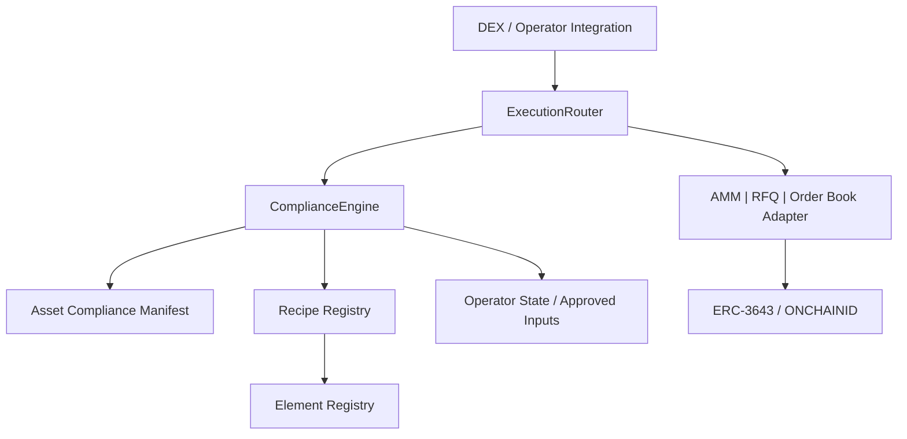

# Corner Store Product and Architecture Baseline

> **Status: Current Product and Architecture Baseline**
>
> 세부 책임과 trust boundary는 [`architecture/README.md`](./architecture/README.md),
> 구현 순서와 완료 조건은 [`ROADMAP.md`](./ROADMAP.md)를 참조한다.
>
> 이 문서는 [`DECISIONS.md`](../DECISIONS.md)의 D003-D005에서 채택한 제품 방향을
> 반영한다. 법률 사례와 Element 목록은 연구 입력이며 production 법률 결론이나
> 활성 정책으로 간주하지 않는다.

## 1. Product Identity

Corner Store 프로젝트의 주 제품은 **DEX-level compliance 표준과 Solidity SDK**다.
Corner Store DEX는 이 SDK가 실제 실행 환경에서 작동함을 증명하는 reference
implementation이다.

| 구분 | 역할 |
| --- | --- |
| 주 제품 | 정책 등록 모델과 교체 가능한 execution venue 경계를 제공하는 Solidity SDK |
| Reference 구현 | SDK에 구체 Adapter와 배포 구성을 결합한 multi-venue Corner Store DEX |
| 외부 기반 | ERC-3643 / ONCHAINID token·identity enforcement |
| 초기 검증 영역 | 미국 Reg D 계열 RWA secondary 거래를 모사한 testnet 시나리오 |

핵심 정체성:

> ERC-3643이 token transfer eligibility의 기반이라면, Corner Store SDK는 market
> access eligibility를 실행 시점에 표현하고 집행하는 기반이다.

장기 성공 기준은 Corner Store DEX 하나의 완성이 아니라, 제3의 DEX나 운영주체가
SDK의 interface와 등록 모델을 재사용할 수 있는가에 있다.

SDK의 확장성은 두 축으로 구성한다.

- compliance plugin: Element, Recipe와 Manifest를 등록·활성화·중단해 정책을
  교체한다.
- execution plugin: 공통 Adapter interface를 구현하고 VenueRegistry에 등록해
  AMM, RFQ, Order Book 또는 외부 DEX 연결을 교체한다.

두 축 모두 새 정책이나 venue를 추가할 때 공통 Router와 evaluation semantics를
수정하지 않는 것을 목표로 한다. 단, 등록과 활성화는 권한 통제와 검토 절차를
통과해야 한다.

## 2. Product Principles

### G1. Compliance by Construction

위반 거래를 사후 탐지하는 데 그치지 않고, 실행 직전의 누적 검사를 통과하지 못한
거래는 체결되지 않아야 한다.

### G2. Build On, Don't Rebuild

ERC-3643이 이미 검증한 수신자 identity나 claim 사실은 가능한 한 재사용한다.
Corner Store는 매도자 상태, resale path, engine, amount, operator처럼 발행 측
transfer 검사만으로 알 수 없는 거래 context를 보완한다.

사실을 재사용하는 것과 운영주체의 독립적인 법률 의무가 사라지는 것은 다르다.
책임 주체별 승인과 기록은 별도로 남아야 한다.

### G3. Regulation as Data

새 규제와 자산은 Router를 수정하는 대신 Element, Recipe와 Manifest를 등록해
확장한다. 새 실행 방식이나 외부 DEX 연결은 공통 Adapter interface를 구현하고
VenueRegistry에 등록해 확장한다.

- Element: 재사용 가능한 사실 검증 단위
- Recipe: 하나의 법률효과를 구성하는 규제 조합
- Manifest: 특정 자산에 적용되는 Recipe와 실행 조건의 binding

법 개정은 version으로 관리하며 기존 listing의 migration 또는 grandfather 정책을
명시한다.

### G4. Hybrid by Design

온체인은 결정적 검증, 권한 게이팅과 집행을 담당한다. 다음 정보는 오프체인에서
처리하고 승인된 결과나 hash만 온체인에 연결한다.

- 법률 해석이나 시세조종처럼 코드가 판정할 수 없는 판단
- 대량 연산과 고성능 분석
- 민감 identity 정보와 법률 문서

### G5. Self-Responsibility by Design

발행자는 토큰과 transfer eligibility를, DEX 운영주체는 시장 접근과 실행을
책임진다. Manifest는 발행자 선언, DEX 검토·승인, 발행 측 coverage와 version을
연결하는 책임 경계다.

### G6. Declining Cost of Compliance

검증된 Element, Recipe와 Manifest template를 재사용해 후속 listing과 integration의
비용이 낮아져야 한다. SDK interface는 특정 자산이나 운영주체에 종속되지 않는다.

## 3. System Shape



Solidity SDK는 두 개의 재사용 가능한 surface를 제공한다.

- Compliance Core: context, Element/Recipe/Manifest, registry, evaluation과 decision
- Execution Integration Kit: `ExecutionRouter`, `VenueRegistry`, 공통 Adapter
  interface, dispatch와 replay protection

Corner Store reference DEX는 이 SDK에 Uniswap v3/RFQ/Order Book의 구체 Adapter,
testnet policy fixture와 배포·운영 구성을 조합한다. SDK의 공통 Router와 interface는
특정 DEX에 종속되지 않으며, reference Adapter 구현은 SDK integrator에게 강제되지
않는다.

## 4. ERC-3643 Boundary

ERC-3643은 외부 token/identity trust boundary다.

| ERC-3643 발행 측 | Corner Store 거래 측 |
| --- | --- |
| ONCHAINID와 Identity Registry | 기존 identity/claim 사실 재사용 |
| Trusted Issuer와 Claim Topic | 발행 측 coverage로 기록 |
| ModularCompliance와 transfer rule | seller, context, resale, engine 조건 보완 |
| token transfer 허용 또는 revert | 실행 전 decision과 venue 제한 |

실제 token movement에서 ERC-3643 transfer가 실패하면 전체 실행은 원자적으로
실패한다. Corner Store의 사전 검사가 ERC-3643을 우회하거나 완화하지 않는다.

### Coverage Delta

Manifest는 발행 측 ModularCompliance가 어떤 사실을 이미 검사하는지 표현할 수
있어야 한다. ComplianceEngine은 같은 claim을 무조건 재조회하기보다 다음 차이만
검사하는 방향을 우선한다.

- 발행 측이 보지 않는 seller 상태
- secondary resale path와 holding period
- amount, direction, venue와 engine
- operator/dealer 상태
- transaction-specific 제한

정확한 coverage encoding은 구현 feature에서 확정한다.

## 5. Named 4-Layer Compliance Stack

Layer는 순번이 아니라 이름으로 부른다.

### Element

Element는 하나의 구성요건 사실을 판정하는 최소 단위다.

예:

- sanctions 또는 jurisdiction
- accredited investor 또는 qualified purchaser
- affiliate 여부
- holding period
- amount 또는 direction
- approved engine, venue 또는 operator

Element는 특정 Recipe에 종속되지 않는 공유 라이브러리다. 기존 Element 재사용을
우선하며 새로운 사실 유형이 필요할 때만 추가한다.

법률 연구에서 제안된 41개 Element 분류는 backlog와 시나리오 입력이다. 개별
Element의 법적 정확성, data source와 enforcement point가 검토되기 전에는 production
정책으로 활성화하지 않는다.

### Recipe

Recipe는 **법률효과 하나**를 표현하는 Element 집합과 활성화 조건이다.

예:

- Reg D 506(c) 발행 면제
- Rule 144 resale safe harbor
- Investment Company Act §3(c)(7) 적용
- engine 또는 market-conduct 조건

한 거래에는 발행, 재판매, 펀드, 행위와 관할 관련 Recipe가 동시에 적용될 수 있다.
활성화된 Recipe는 선택적으로 하나만 통과하는 것이 아니라 **누적 AND**로
평가한다.

### Manifest

Asset Compliance Manifest는 자산별 적용 규제와 실행 조건을 묶는 binding layer다.
기존 `token -> single recipe` 또는 광범위한 Token Policy 개념을 다음 정보로
확장한다.

- issuance, fund와 resale 관련 Recipe reference와 version
- 허용 resale path
- 지원 engine/venue type
- manifest state와 scope
- Recipe 활성화에 필요한 asset facts
- 발행 측 compliance coverage
- off-chain full manifest의 hash anchor

개념 예시:

```solidity
struct ManifestCore {
    bytes32 manifestId;
    uint64 version;
    uint256 supportedEngines;
    uint256 enabledResalePaths;
    bytes32 recipeSetHash;
    bytes32 issuerCoverageHash;
    bytes32 fullManifestHash;
    ManifestState state;
}
```

이는 ABI 확정안이 아니다. packing, ID 체계, inline storage 여부와 token 단위 또는
token×venue 단위 scope는 구현 전 결정한다.

Manifest lifecycle은 최소 `PROPOSED`, `ACTIVE`, `SUSPENDED`, `RETIRED`를 구분해야 한다.
`ACTIVE` Manifest의 불완전한 Recipe/reference는 fail-closed다.

일반 ERC-20 public execution은 자산이 명시적으로 `UNREGULATED`로 분류된 경우에만
pass-through로 처리한다. Manifest와 `UNREGULATED` 분류가 모두 없는 자산은
`UNKNOWN`으로 fail-closed한다. public path에는 Corner Store의 4-Layer 보장이 없다.

### Operator

Operator는 코드가 스스로 결정할 수 없는 승인, 판단, 감시와 시장 운영을 담당한다.

- listing과 Manifest 승인
- Element/Recipe 등록 심사
- market surveillance와 보고
- emergency suspension
- off-chain 판단 결과의 권한 통제된 입력

SDK는 role, registry, state와 audit hook을 제공할 수 있지만 실제 라이선스,
법률 책임자, multisig 구성과 운영 절차를 대신 결정하지 않는다.

## 6. Multi-Recipe Evaluation

```text
request
  -> tokenIn/tokenOut classification과 Manifest 조회
  -> 양쪽 자산의 Manifest facts와 transaction context로 applicable Recipes 식별
  -> Recipe별 Element reference를 합집합으로 구성
  -> 중복 Element는 동일 context에서 한 번만 평가
  -> 활성 Element를 cumulative AND로 검사
  -> 허용 engine, venue, amount, version을 decision에 binding
  -> 등록된 Adapter 실행
  -> ERC-3643 transfer enforcement
```

개념적 의사코드:

```text
inputPolicy = manifestRegistry.resolve(tokenIn, venueContext)
outputPolicy = manifestRegistry.resolve(tokenOut, venueContext)

if inputPolicy.classification == UNREGULATED
   and outputPolicy.classification == UNREGULATED:
    return publicPassThrough()

require(inputPolicy.classification != UNKNOWN)
require(outputPolicy.classification != UNKNOWN)
requireActiveIfRegulated(inputPolicy)
requireActiveIfRegulated(outputPolicy)

manifests = regulatedManifests(inputPolicy, outputPolicy)
recipes = identifyApplicableRecipes(manifests, transactionContext)
elements = union(recipes.elementSubset)

for element in elements:
    require(element.check(transactionContext))

return bindDecision(manifests, recipes, transactionContext)
```

양쪽 자산이 모두 명시적 `UNREGULATED`일 때만 public pass-through를 허용한다.
한쪽이라도 `UNKNOWN`이면 거부하며, 한쪽 이상이 regulated이면 해당하는 모든
`ACTIVE` Manifest의 Recipe를 거래 전체 context에 누적 적용한다. 따라서
unregulated-regulated mixed pair와 regulated-regulated pair 모두 regulated 자산의
정책을 우회할 수 없다.

Router와 ComplianceEngine의 정확한 함수 분리는 구현 단계에서 정하지만 다음
책임은 유지한다.

- ComplianceEngine: Manifest 해석, Recipe orchestration, Element 평가와 decision
- ExecutionRouter: request/decision binding, replay 방지와 Adapter dispatch
- Adapter: venue-specific validation과 settlement

## 7. Compliance Decision

평가 결과는 boolean 하나가 아니라 실행 가능한 context를 구조화해 반환한다.

```solidity
struct ComplianceDecision {
    bool allowed;
    bytes32 manifestId;
    uint64 manifestVersion;
    bytes32 appliedRecipesHash;
    uint64 validUntil;
    uint256 maxAmount;
    uint256 allowedVenueTypes;
    bytes32 allowedVenuesHash;
    bytes32 reasonCode;
    bytes32 decisionHash;
}
```

`decisionHash`는 최소 actor, token, amount, direction, venue/engine, order 또는
quote, manifest version, nonce와 expiry에 바인딩되어야 한다. preview 결과는
표시용이며 settlement 권한으로 재사용하지 않는다.

## 8. Venue Execution

Corner Store reference DEX는 실행 엔진을 Adapter로 분리한다.

### AMM

Uniswap v3는 첫 AMM reference adapter다. Pool identity onboarding, factory/pool과
callback origin 검증, request binding, callback payment와 잔액 불변성을 요구한다.

AMM 허용 여부는 자산 이름이나 Router 코드에 하드코딩하지 않고 Manifest와 활성
Recipe가 결정한다.

### RFQ

RFQ는 기관·대량·지정 상대방 거래를 위한 경로다. 견적 탐색은 오프체인에서,
signature/nonce/expiry와 최신 compliance 검사는 settlement 트랜잭션에서 수행한다.

### Order Book

Order Book은 지정가, 취소, 부분 체결과 matcher/operator가 필요한 경우를 위한
adapter다. matching의 온체인/오프체인 위치와 custody 모델은 아직 열린 결정이다.

어떤 engine이 특정 규제 시나리오에 적합한지는 법률 검토와 Manifest 승인 결과로
결정한다. 연구 입력의 BUIDL/affiliate 사례는 multi-Recipe와 engine gating을
설명하는 예시이지 production 법률 판정이 아니다.

## 9. On-chain / Off-chain Boundary

| 유형 | 처리 위치 | 온체인 책임 |
| --- | --- | --- |
| 결정적 사실 검증 | 온체인 또는 승인된 claim 조회 | 직접 차단 |
| 전문가 attestation | 오프체인 발급 | issuer, scope, expiry 검증 |
| 재량 판단 | 운영주체/법률 전문가 | 승인된 상태 입력과 거래 게이팅 |
| 민감·대량 자료 | 오프체인 저장·연산 | hash와 승인 주체 검증 |

권한 있는 입력 함수와 거래 시점 reference 함수는 분리한다. hot path에는 bounded
조회와 검증만 남기고 법률 문서나 대량 데이터를 저장하지 않는다.

## 10. State and Audit

상태 변경은 registration, activation, version update, suspension과 retirement를
구분한다. 권한은 가능한 한 다음 capability로 분리한다.

- Element/Recipe 등록
- Manifest 제안·승인·활성화
- venue/operator 등록
- emergency suspension
- execution

성공한 평가와 실행은 manifest version, applied Recipe set와 reason code를 추적할
수 있어야 한다.

실패 거래는 revert 시 event도 사라지므로 reject audit trail 방식은 아직 열린
결정이다. `(success, reason)` 반환, 상위 try/catch event 또는 off-chain indexer
중 하나를 구현 전 선택하며, 현재 문서는 특정 방식을 확정하지 않는다.

## 11. Open Design Decisions

### Blocking

- Rule 144 holding period를 위한 acquisition/lot data source
- Manifest 적용 단위: token 또는 token×venue
- 초기 testnet 시나리오와 engine

### Interface Decisions

- stateful Element용 commit hook signature와 호출 시점
- ManifestCore packing, recipe set representation과 issuer coverage encoding
- duplicate Element evaluation key와 context schema
- decision/preview API

### Operations and Legal

- reject logging과 기록 보존
- Manifest 공개 범위
- KYC/claim provider
- production operator, governance와 key management
- 규제별 engine 허용 조건과 production legal approval

## 12. Product Scope

### Current Implementation Scope

- Compliance Core SDK: context, Element/Recipe/Manifest registry와 evaluation
- Execution Integration Kit: structured decision, generic `ExecutionRouter`,
  `VenueRegistry`와 공통 Adapter interface
- 양쪽 자산 Manifest를 결합하는 cumulative multi-Recipe orchestration
- Corner Store reference DEX: Uniswap v3 reference adapter, RFQ/Order Book 예제
  확장점과 testnet 구성
- mock ERC-3643 기반 testnet E2E

### External Collaboration Scope

- production Element의 법률 승인
- 발행자와 DEX의 실제 책임 계약
- Reg ATS, broker-dealer 또는 관할별 라이선스
- 운영조직, monitoring, reporting와 dispute process
- production identity/KYC provider

### Non-goals

- ERC-3643 또는 ONCHAINID 구현을 저장소에 복제
- 모든 규제를 하나의 hardcoded Recipe로 구현
- Router 내부에서 matching 또는 법률 해석 수행
- 명시적 `UNREGULATED` 분류 없이 public path를 허용
- reference DEX의 구현 선택을 SDK integrator에게 강제
