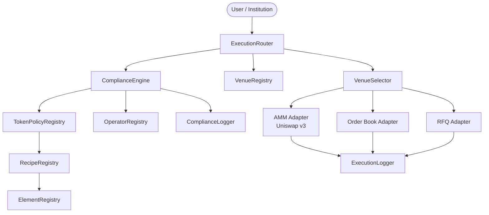
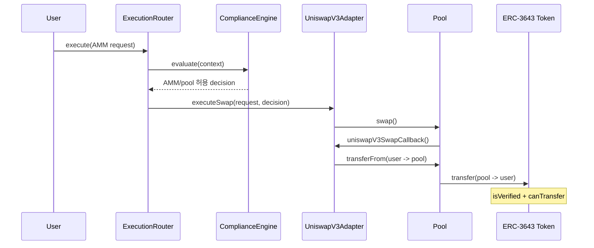
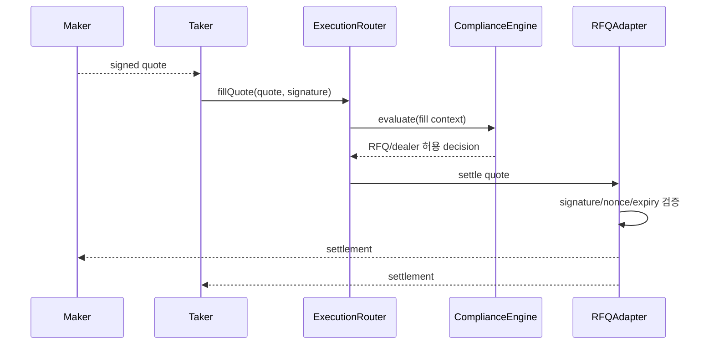

# Corner Store MVP v2 - Multi-Venue Execution

> **Status: Current Product and Architecture Baseline**
>
> 책임 레이어별 요약과 열린 결정은 [`architecture/README.md`](./architecture/README.md),
> 구현 순서와 완료 조건은 [`ROADMAP.md`](./ROADMAP.md)를 참조한다.
>
> 이 문서는 기존 `MVP.md`의 ERC-3643 재사용, Element/Recipe 조합, Uniswap v3
> AMM 설계를 계승하면서 AMM, Order Book, RFQ를 자산별로 선택할 수 있도록
> 확장한 설계안이다. 기존 `MVP.md`는 v1 설계 기록으로 유지한다.
>
> 미국 증권법 관련 세부 요건은 법률 검토 중이다. 이 문서는 법률 결론이 아니라
> 변경되는 규제 요건을 수용할 기술적 구조와 MVP 구현 순서를 정의한다.

## 1. 변경 배경

v1은 모든 거래가 Uniswap v3 Pool을 통과하는 AMM 중심 구조였다. 추가 법률 검토에
따르면 발행 방식, 유통 제한, 투자자 유형, 거래 규모, 상대방 및 운영자 요건에 따라
허용 가능한 매칭 엔진이 달라질 수 있다.

따라서 Uniswap v3를 전체 거래 시스템으로 취급하지 않고, Corner Store가 지원하는
여러 실행 venue 중 첫 번째 AMM 구현체로 재정의한다.

```text
v1: ComplianceRouter -> Uniswap v3 Pool

v2: ExecutionRouter
      -> ComplianceEngine
      -> VenueRegistry / VenueSelector
      -> AMM | Order Book | RFQ Adapter
```

핵심 원칙:

- 법률·컴플라이언스 판단과 매칭 엔진 실행을 분리한다.
- 규제가 불확실한 RWA 거래 경로는 기본 거부한다.
- 거래 가능 여부를 단순 boolean이 아닌 구조화된 결정으로 표현한다.
- 주문 생성 시점뿐 아니라 실제 체결·결제 시점에도 컴플라이언스를 재검증한다.
- 각 venue의 custody, settlement, operator 모델을 개별적으로 등록한다.

---

## 2. 전체 아키텍처



`ExecutionRouter`가 모든 거래 요청의 진입점이다. `ComplianceEngine`은 거래 조건과
정책을 평가해 허용 venue, 최대 수량, 유효기간 등이 포함된 결정을 반환한다.
`ExecutionRouter`는 그 결정 안에서만 venue를 선택하거나 사용자가 지정한 venue를
검증한 뒤 해당 Adapter로 실행을 위임한다.

MVP에서는 자동 최적 체결이나 주문 분할을 구현하지 않는다. 사용자가 venue를
명시하고 Router가 허용 여부를 검증하는 방식으로 시작한다.

---

## 3. ERC-3643 재사용 범위

ERC-3643은 발행 측 보유 자격과 transfer-level compliance를 담당한다.
Corner Store는 그 위에서 거래 시점, venue, 상대방, 운영자 및 주문 조건을 검사한다.

| ERC-3643 발행 측 | Corner Store 거래·실행 측 |
| --- | --- |
| ONCHAINID · Identity Registry | 재사용 |
| Trusted Issuers · Claim Topics | 재사용 |
| Compliance Modules | 재사용 |
| `isVerified` · `canTransfer` | 최종 transfer 시 재사용 |
| 없음 | TokenPolicyRegistry |
| 없음 | ElementRegistry + Elements |
| 없음 | RecipeRegistry + Recipes |
| 없음 | ComplianceEngine |
| 없음 | ExecutionRouter |
| 없음 | VenueRegistry + Adapters |
| 없음 | OperatorRegistry |

ERC-3643 transfer 검사는 Corner Store 사전 검증을 대체하지 않는다. 사전 검증에서
거래 규칙과 venue 허용 여부를 검사하고, 실제 토큰 이동 시 ERC-3643이 발행자 측
규칙을 다시 검사한다.

---

## 4. Compliance Decision

컴플라이언스 결과는 `true/false`가 아니라 실행 조건이 포함된 구조체로 반환한다.

```solidity
struct ComplianceDecision {
    bool allowed;
    bytes32 policyId;
    uint64 policyVersion;
    uint64 validUntil;
    uint256 maxAmount;
    uint256 allowedVenueTypes;
    bytes32 allowedVenuesHash;
    bytes32 reasonCode;
    bytes32 decisionHash;
}
```

`allowedVenuesHash`의 encoding과 검증 API는 구현 Phase 1에서 확정한다. 이 필드는
허용 venue type만 맞으면 임의의 venue에서 실행할 수 있는 모호성을 제거하기 위한
context binding이다.

`decisionHash`는 최소한 다음 값에 바인딩되어야 한다.

- buyer, seller, initiator
- tokenIn, tokenOut
- 거래 방향과 최대 수량
- offering 또는 program 식별자
- order 또는 quote 식별자
- 허용 venue 종류 또는 정확한 venue 주소
- 정책 버전과 만료 시각

다른 사용자, 수량, 토큰, venue에 결정을 재사용할 수 없어야 한다.

---

## 5. 3-Layer Compliance 구조

### Layer 1 - Element

Element는 하나의 검증 책임만 가진다. 법률 검토 결과에 따라 기존 4종보다 종류가
늘어날 수 있으므로 카테고리를 고정하지 않는다.

초기 후보:

| 카테고리 | Element 예시 |
| --- | --- |
| 신원·상태 | Sanctions, Jurisdiction, AccreditedInvestor |
| 발행·프로그램 | OfferingEligibility, InvestorLimit |
| 유통 | Lockup, HoldingPeriod, ResaleRestriction |
| 거래 | Counterparty, AmountLimit, Direction |
| Venue | VenueType, ApprovedVenue, Custody |
| 운영자 | ApprovedOperator, DealerEligibility |
| 보고 | ReportingRequired, SurveillanceRequired |

Element 로직은 가능한 한 immutable로 배포한다. 외부 데이터 주소와 기준값은
versioned reference로 관리한다.

### Layer 2 - Recipe / Policy

Recipe는 Element를 조합해 규제 프로그램을 표현한다. `TokenPolicyRegistry`는 단순한
`token -> recipe`를 넘어 다음 정보를 관리한다.

- recipe 및 버전
- offering 또는 distribution program
- 허용 거래 방향
- 허용 venue type 및 주소
- 허용 operator
- 금액 및 보유 한도
- custody와 settlement 조건
- 정책 효력 기간과 긴급 중단 상태

법률 검토 중인 조건은 permissive default로 두지 않고 `UNKNOWN` 또는 비활성
정책으로 관리한다.

### Layer 3 - Operator

라이선스, 시장감시, AML 모니터링, 공시, 분쟁처리와 실제 운영조직은 Corner Store의
현재 구현 범위가 아니다. 이 영역은 외부 법률 검토자와 향후 운영주체의 입력 및
운영이 필요하다.

Layer 2 연동을 위해 MVP에 포함하는 기술적 경계:

- OperatorRegistry
- operator와 venue 연결
- operator 활성·중단 상태
- venue 긴급 중단
- 감시·보고 이벤트 hook

이 기능은 Layer 3 운영을 대체하지 않는다. 법률상 필요한 라이선스, 책임 주체,
승인 절차와 실제 관리자 구성은 코드가 아니라 외부 법률 검토와 운영 설계가
결정한다.

---

## 6. Venue Registry와 선택 정책

```solidity
enum VenueType {
    AMM,
    ORDER_BOOK,
    RFQ
}
```

`VenueRegistry`는 다음 메타데이터를 관리한다.

- venue type과 adapter
- 실제 pool, market 또는 settlement 주소
- operator
- custody 모델
- settlement 모델
- 지원 token 또는 pair
- 활성·중단 상태

단순한 `token -> pool` 매핑은 사용하지 않는다.

```text
token/pair
  + policy scope
  + transaction context
  + venue type
  + approved implementation
```

선택 예시:

```text
RWA-A 소액 거래          -> AMM 허용
RWA-A 기준액 초과 거래   -> RFQ만 허용
RWA-B 지정가 거래        -> Order Book 허용
RWA-C 기관 간 거래       -> 승인된 RFQ dealer만 허용
RWA-D 법률 검토 미완료    -> 모든 venue 거부
```

---

## 7. Venue별 실행 모델

### 7.1 AMM - Uniswap v3

Uniswap v3는 첫 번째 AMM venue다. 집중 유동성과 기존 SDK·subgraph 생태계를
재사용한다.



AMM Adapter 책임:

- 등록된 Uniswap factory와 pool 검증
- callback origin 검증
- decision과 정확한 pool·swap parameter 바인딩
- callback 결제
- 잔여 토큰 비보관

#### Pool Identity 등록

ERC-3643 토큰을 Pool이 보유하려면 Pool 주소가 IdentityRegistry에 venue로 등록되어야
한다. Uniswap v3 CREATE2 주소를 사전 계산해 발행자가 등록한 후 Pool을 생성한다.
RWA-RWA pair는 양쪽 IdentityRegistry 등록이 필요하다.

### 7.2 RFQ

RFQ는 기관·대량·승인 상대방 거래를 위한 실행 경로다. 견적 탐색과 협상은 오프체인,
검증과 결제는 온체인으로 시작한다.

필수 모델:

- EIP-712 maker 서명
- 지정 taker 또는 taker class
- token, amount, price 바인딩
- quote 만료
- nonce와 replay 방지
- 부분 체결 허용 여부
- dealer/operator 권한
- fill 시점 양 당사자 컴플라이언스 재검증



### 7.3 Order Book

Order Book은 지정가, 부분 체결, 가격·시간 우선순위 또는 승인 matcher가 필요한
시장에 사용한다.

필수 모델:

- signed order
- 취소와 nonce 무효화
- 만료
- 부분 체결과 잔여 수량
- matcher/operator 권한
- maker/taker 체결 시점 재검증
- market 식별자
- 감시·보고 이벤트

주문 등록 시점 검증만으로는 부족하다. 제재, 신원, lockup 또는 정책이 변경될 수
있으므로 각 fill 트랜잭션에서 최신 정책과 actor/operator 상태를 평가한다.

온체인 matching과 오프체인 matching + 온체인 settlement 중 어느 방식을 사용할지는
법률·성능·운영자 요구사항이 확정된 후 결정한다.

---

## 8. Custody와 Identity 등록

v1의 "Pool만 등록하면 된다"는 가정은 AMM에만 적용된다. v2에서는 실제 토큰을
수신하거나 보유하는 주소를 venue별로 판단한다.

| 구성요소 | 등록 가능성 | 판단 기준 |
| --- | --- | --- |
| Uniswap v3 Pool | 필요 | RWA 유동성 보유 |
| UniswapV3Adapter | 일반적으로 불필요 | callback 중 경유만 하고 잔액 미보유 |
| Order Book settlement | 구조에 따라 필요 | escrow 또는 토큰 수신 여부 |
| RFQ settlement | 구조에 따라 필요 | settlement가 토큰을 수신하는지 |
| Operator custody wallet | 필요 가능 | 실제 custody 역할 여부 |
| 투자자·dealer 주소 | 필요 | 발행자 정책과 ERC-3643 등록 상태 |

각 venue 등록 시 custody 및 settlement metadata를 명시하고, 배포·활성화 전에 필요한
IdentityRegistry 등록을 preflight로 검사한다.

---

## 9. Factory와 등록 흐름

`CornerStoreFactory` 하나가 모든 matching engine을 직접 배포하지 않는다. 공통
오케스트레이션과 venue별 factory를 분리한다.

```text
CornerStoreFactory / VenueOnboarding
├── TokenPolicyRegistry 등록
├── VenueRegistry 등록
├── Operator 연결
└── venue-specific factory 호출
    ├── UniswapV3VenueFactory
    ├── OrderBookMarketFactory
    └── RFQ settlement 등록
```

AMM 등록 흐름:

1. Uniswap v3 Pool 주소 계산
2. 발행자 IdentityRegistry venue 등록
3. 등록 상태 preflight
4. Pool 생성
5. UniswapV3Adapter와 VenueRegistry 등록
6. TokenPolicyRegistry에서 AMM 허용 정책 활성화

Order Book과 RFQ는 구현체 주소, operator, custody, settlement 등록을 완료한 후
정책을 활성화한다.

`delistToken`이 단순히 compliance 검사를 제거해 일반 토큰 경로로 통과시키면 안 된다.
규제 토큰의 delist는 정책과 venue를 중단하고 신규 실행을 거부해야 한다.

---

## 10. Early Exit와 일반 ERC-20

일반 ERC-20은 `TokenPolicyRegistry`에 명시적으로 `UNREGULATED`로 등록된 경우에만
등록된 public venue로 빠르게 통과시킬 수 있다. policy mapping 부재로 RWA 여부나
규제 상태를 추론하지 않는다.

```text
TokenPolicyRegistry status
├── UNREGULATED -> public venue 실행
├── ACTIVE      -> ComplianceEngine 평가
├── SUSPENDED   -> 실행 거부
└── UNKNOWN     -> 실행 거부
```

pair 거래에서는 양쪽 토큰 상태를 모두 해석한다. 양쪽 모두 `UNREGULATED`일 때만
fast path를 사용하고, 한쪽이라도 `ACTIVE`이면 regulated token/program policy가
counterparty asset, 방향과 venue를 포함한 전체 거래 context를 평가한다.

이 구분은 규제 토큰을 delist한 뒤 실수로 unrestricted path로 보내는 문제를 방지한다.

---

## 11. 컨트랙트별 책임

| 컨트랙트 | 책임 | 책임 아닌 것 |
| --- | --- | --- |
| ExecutionRouter | 결정 검증, adapter dispatch, nonce·deadline | 법률 규칙 구현, matching |
| ComplianceEngine | context 평가, Recipe 실행, decision 생성 | venue 실행 |
| TokenPolicyRegistry | token/program별 정책과 상태 관리 | Recipe 실행 |
| VenueRegistry | venue, adapter, operator, custody metadata | 가격 선택 |
| VenueSelector | 허용된 venue 검증·결정적 선택 | 법률 판단 |
| Elements | 단일 규칙 검증 | 다른 규칙과 execution |
| Recipes | Element 조합 | matching engine 실행 |
| UniswapV3Adapter | swap, callback, pool 검증 | RFQ·Order Book |
| RFQAdapter | quote 검증과 settlement | quote negotiation |
| OrderBookAdapter | order lifecycle와 fill settlement | 법률 정책 정의 |
| OperatorRegistry | operator 권한·상태·venue 연결 | 라이선스 판정 |
| ComplianceLogger | 정책 평가 audit event | 실행 상태 관리 |
| ExecutionLogger | 공통 execution event | compliance 판단 |

---

## 12. 컨트랙트 구조

```text
src/
├── execution/
│   ├── ExecutionRouter.sol
│   ├── VenueRegistry.sol
│   ├── VenueSelector.sol
│   ├── ExecutionTypes.sol
│   └── adapters/
│       ├── IExecutionAdapter.sol
│       ├── amm/
│       │   ├── IAMMAdapter.sol
│       │   └── UniswapV3Adapter.sol
│       ├── rfq/
│       │   ├── IRFQAdapter.sol
│       │   └── RFQAdapter.sol
│       └── orderbook/
│           ├── IOrderBookAdapter.sol
│           └── OrderBookAdapter.sol
├── compliance/
│   ├── ComplianceEngine.sol
│   ├── ComplianceTypes.sol
│   ├── elements/
│   └── recipes/
├── registry/
│   ├── TokenPolicyRegistry.sol
│   ├── RecipeRegistry.sol
│   ├── ElementRegistry.sol
│   └── OperatorRegistry.sol
├── factory/
│   ├── CornerStoreFactory.sol
│   └── UniswapV3VenueFactory.sol
└── logging/
    ├── ComplianceLogger.sol
    └── ExecutionLogger.sol
```

---

## 13. 배포 도구

`tools/deploy-v3`는 Uniswap v3 AMM 인프라 전용 배포 도구로 사용한다. 실제 포함
범위와 제외 결정은
[`CORNER_STORE_PROFILE.md`](../tools/deploy-v3/CORNER_STORE_PROFILE.md)를 기준으로
한다.

배포 대상:

- UniswapV3Factory
- NonfungiblePositionManager와 descriptor 의존성
- QuoterV2
- TickLens와 interface multicall
- Factory와 ProxyAdmin ownership transfer

현재 기본 배포에서 제외:

- SwapRouter02
- V3Migrator
- UniswapV3Staker
- 1bp fee tier

개별 Pool은 deploy-v3가 미리 배포하는 것이 아니라 이후
`UniswapV3VenueFactory`의 등록 흐름에서 생성한다.

Order Book과 RFQ는 별도 배포 스크립트와 manifest를 사용한다. 모든 배포 결과는
`deployments/<chain-id>/`의 versioned JSON manifest로 연결한다. 사람이 읽는 network
이름은 manifest 내부 metadata에 기록한다.

---

## 14. 구현 순서

구현 Phase와 완료 조건은 [`ROADMAP.md`](./ROADMAP.md)를 단일 기준으로 사용한다.
이 문서는 제품 범위와 아키텍처 요구사항을 정의하며 별도의 Phase 번호를 부여하지
않는다.

첫 번째 end-to-end delivery path는 공통 Policy/Execution 기반과 Uniswap v3 AMM이다.
RFQ는 공통 기반 위에서 별도로 진행하고, Order Book은 matching/custody 모델이
결정되기 전에는 구현하지 않는다.

---

## 15. MVP 스코프

### MVP v1 - 현재 구현 범위

- 외부 법률 검토 결과를 policy와 enforcement point로 변환하는 illustrative
  Legal-to-Technical Matrix
- TokenPolicyRegistry, VenueRegistry, OperatorRegistry
- ComplianceEngine과 구조화된 ComplianceDecision
- ExecutionRouter와 Adapter 등록 구조
- Uniswap v3 AMM 배포 및 UniswapV3Adapter
- 법률 결론으로 사용하지 않는 illustrative/mock Element와 Recipe
- mock ERC-3643 토큰과 일반 ERC-20 quote token
- mock ERC-3643/ERC-20 Pool의 방향별 AMM 허용·거부 E2E
- 명시적 `UNREGULATED` 일반 ERC-20 경로
- 허용, policy 거부, identity 거부, ERC-3643 transfer 거부 E2E 테스트

MVP v1은 AMM 거래가 허용된 illustrative mock policy에서 매수·매도 방향별 허용
시나리오가 성공하고, 금지된 방향이나 ERC-3643 transfer enforcement 또는 Corner
Store Layer 1~2 policy가 거부한 swap이 원자적으로 실패할 때 완료된다. 실제 자산은
정책에 따라 한 방향 또는 양쪽 방향 모두 금지될 수 있다.

### Next Release - Interface Only

- RFQ request/quote schema와 Adapter interface

### Future RFQ Implementation

- 최소 RFQ settlement 구현
- RFQ UI 또는 institution API
- threshold 기반 AMM/RFQ venue 정책

### Compatibility Target

- RFQ와 Order Book을 추가할 수 있는 공통 Adapter 경계
- venue별 custody, operator, settlement metadata

### Out Of Scope / Future

- 완전한 Order Book 구현
- 자동 best execution과 smart order routing
- multi-venue order splitting
- 실제 KYC·sanctions provider
- 프로덕션 Oracle
- 전체 operator business workflow
- Layer 3 라이선스, 시장감시, AML 운영, 공시와 분쟁 처리
- 실제 관리자 조직, multisig 구성과 법률 승인 절차
- 보안 감사와 프로덕션 배포

---

## 16. 검증 기준

### Unit

- policy 상태와 버전
- decision hash parameter binding
- allowed venue type 및 주소 검증
- venue/operator suspension
- AMM callback origin
- 일반 ERC-20의 명시적 `UNREGULATED` 처리
- ERC-3643 identity와 transfer 거부 전파

### Integration

- illustrative policy가 허용한 mock ERC-3643 매도 방향 swap
- illustrative policy가 허용한 mock ERC-3643 매수 방향 swap
- 정책상 금지된 매수 또는 매도 방향 swap 거부
- 일반 ERC-20 pair의 허용된 AMM swap
- 미검증 주소가 mock ERC-3643을 수신하는 swap 거부
- Layer 2 policy가 거부한 swap
- ERC-3643 `canTransfer`가 거부한 swap의 전체 롤백
- venue 생성 후 긴급 중단

### Invariant

- 미등록 Adapter를 통한 실행 불가
- decision의 maxAmount 초과 불가
- 다른 사용자·토큰·venue에 decision 재사용 불가
- Router와 Adapter에 의도하지 않은 잔액이 남지 않음
- suspended venue 신규 실행 불가
- ERC-3643 transfer enforcement 또는 Layer 1~2 policy 거부 시 Pool과 사용자
  잔액 변경 없음

---

## 17. 기술 스택

| 항목 | 선택 |
| --- | --- |
| 체인 | GIWA, OP Stack L2, EVM 호환 |
| AMM | Uniswap v3 |
| RFQ | EIP-712 signed quote + on-chain settlement |
| Order Book | 방식 미정, on-chain settlement 필수 |
| 컴플라이언스 | Corner Store ComplianceEngine |
| 신원/ID | ERC-3643 · ONCHAINID 재사용 |
| 컨트랙트 개발 | Solidity, Foundry |
| Uniswap 배포 | vendored `tools/deploy-v3` |
| 인덱싱 | The Graph 또는 동등한 event indexer |
| 프론트엔드 | TypeScript, wagmi, viem |

---

## 18. v1 대비 주요 변경

| v1 | v2 |
| --- | --- |
| ComplianceRouter 단일 진입 | ExecutionRouter + ComplianceEngine |
| token -> Recipe | token/program -> versioned Policy |
| token -> Pool | context -> permitted venue set |
| Uniswap v3가 DEX 전체 | Uniswap v3는 AMM Adapter |
| synchronous swap 중심 | swap, quote fill, order fill lifecycle |
| Pool만 custody 등록 | venue별 custody/settlement 등록 |
| Layer 3 Phase 3 placeholder | 최소 OperatorRegistry를 초기 포함 |
| delist 후 early exit | regulated token은 suspend 후 실행 거부 |
| boolean compliance | 조건이 포함된 ComplianceDecision |
