## 1. 전체 아키텍처

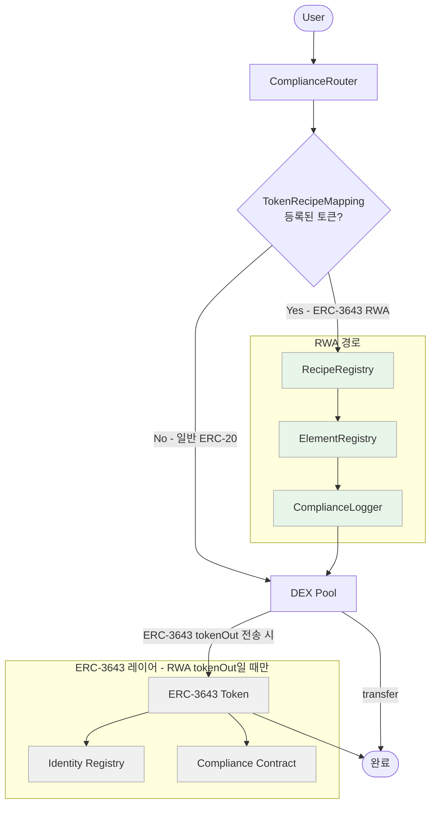

모든 swap은 ComplianceRouter를 통해 들어옴. TokenRecipeMapping 조회 결과에 따라 경로가 나뉨. 일반 ERC-20은 SLOAD 한 번만 추가되고 Pool로 직행. ERC-3643 RWA 토큰만 Recipe → Element 체인을 거침. Pool에서 ERC-3643 토큰을 전송할 때 isVerified · canTransfer가 추가로 한 번 더 실행됨.

---

## 2. ERC-3643 실제 동작 구조 — 먼저 이해해야 할 것

Corner Store가 ERC-3643 위에 무엇을 추가하는지를 설명하기 전에, ERC-3643이 실제로 어떻게 동작하는지부터 정리.

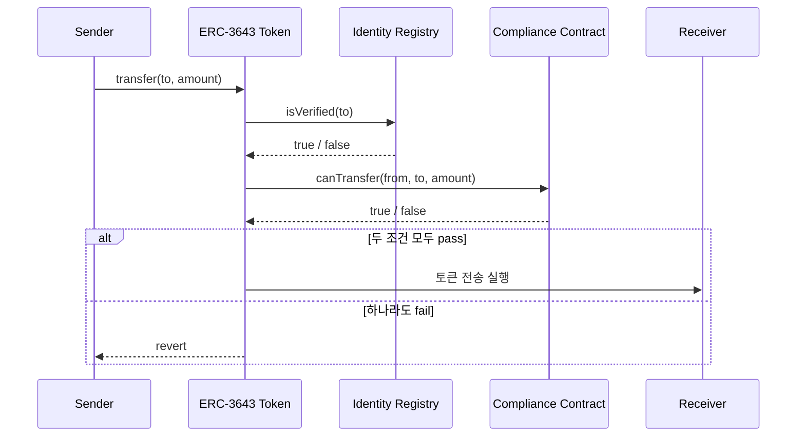

핵심은 두 가지. `isVerified`는 수신자가 IdentityRegistry에 등록된 신원인지 확인하고, `canTransfer`는 Compliance 컨트랙트에 붙어 있는 모듈들(보유 한도, 국가 제한 등)을 순회하며 발행 측 규칙을 검사함.

**ERC-3643이 이미 하는 것 — 발행 측 규칙**

- 수신자가 KYC된 주소인지 (IdentityRegistry)
- 보유 한도 초과 여부 (MaxBalance 모듈)
- 특정 국가 투자자 차단 (CountryAllow 모듈)

**ERC-3643이 하지 않는 것 — 거래 측 규칙**

- Lockup 기간 중인 토큰을 매도하는 행위 차단
- OFAC 제재 주소가 구매자인지 확인
- 거래 쌍방의 Rule 144 충족 여부

Corner Store가 추가하는 건 이 거래 측 규칙. ERC-3643을 재발명하는 게 아니라 그 위에 붙이는 구조.

---

## 3. ERC-3643 재사용 범위

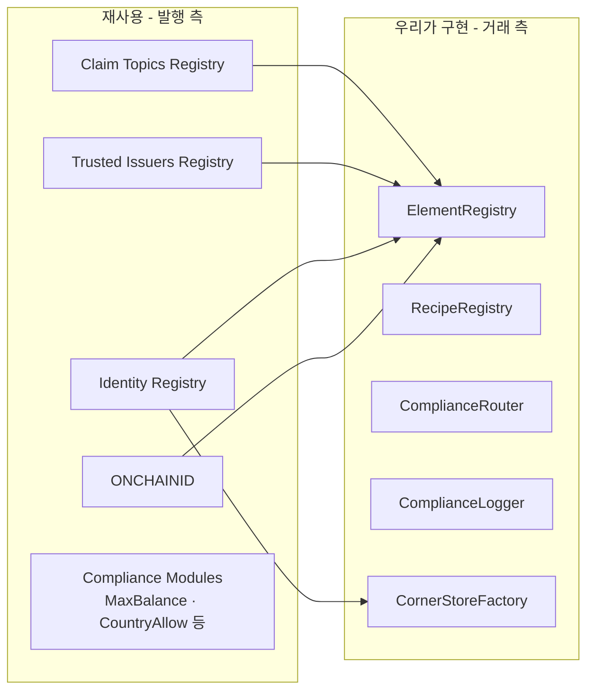

T-REX Factory로 발행 측 컨트랙트 5개를 트랜잭션 한 번에 배포. GIWA가 EVM 호환이므로 어댑터 없이 그대로 사용.

| ERC-3643 발행 측               | Corner Store 거래 측                                 |
| ------------------------------ | ---------------------------------------------------- |
| ONCHAINID · Identity Registry  | 재사용                                               |
| Compliance Modules (발행 규칙) | 재사용                                               |
| isVerified · canTransfer       | 재사용 (pool 등록 후)                                |
| 없음                           | CornerStoreFactory (pool 주소 사전 계산 · 등록 조율) |
| 없음                           | ElementRegistry + Elements (거래 규칙)               |
| 없음                           | RecipeRegistry (규제 조합)                           |

---

## 4. AMM + ERC-3643 호환 문제

여기서 구조상 중요한 문제가 생김.

Uniswap pool은 스마트컨트랙트임. ERC-3643 토큰을 pool에 보내려면 pool 주소가 IdentityRegistry에 등록되어 있어야 함. 등록되어 있지 않으면 `transfer(poolAddress, amount)`가 `isVerified(poolAddress) = false`로 revert됨.

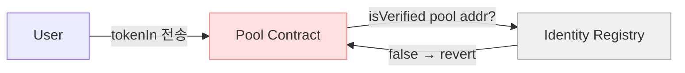

이걸 해결하지 않으면 swap 자체가 불가능함. 해결 방법은 pool 컨트랙트를 IdentityRegistry에 "venue" 클레임을 가진 특수 주체로 등록하는 것. CornerStoreFactory의 `computePoolAddress()`로 배포 전에 pool 주소를 미리 계산해서 발행자에게 전달하고, 발행자가 직접 IdentityRegistry에 등록한 뒤 Factory가 pool을 배포하는 순서로 해결.

---

## 5. DEX 레이어 — 선택과 이유

### AMM 버전 비교

|                 | v2           | v3           | v4                 | Algebra     |
| --------------- | ------------ | ------------ | ------------------ | ----------- |
| 유동성 효율     | 낮음         | 높음         | 높음               | 높음        |
| 라이선스        | GPL          | GPL          | BUSL (2027)        | BUSL        |
| compliance 통합 | wrapper 방식 | wrapper 방식 | hook 내장 가능     | plugin 방식 |
| MVP 현실성      | 가능         | 가능         | 조건부             | 가능        |
| **선택**        |              | **MVP**      | **향후 migration** | **차선**    |

**Uniswap v2 — 제외**

`x*y=k` 수식으로 전체 가격 구간에 유동성이 고르게 분산됨. 초기 RWA 시장처럼 유동성이 얇은 환경에서는 LP 자본이 대부분 사용되지 않는 구간에 묶임. 같은 자본 대비 슬리피지가 커서 부적합.

**Uniswap v3 — 선택**

집중 유동성(concentrated liquidity)으로 LP가 특정 가격 구간에 자본을 집중할 수 있음. 같은 자본으로 v2 대비 훨씬 깊은 유동성을 만들 수 있어 초기 RWA 시장에 적합. GPL 라이선스라 자유롭게 fork 가능. 코드베이스가 가장 검증되어 있고, subgraph·SDK 등 생태계 도구를 그대로 사용할 수 있음.

**Uniswap v4 — 보류**

`beforeSwap` 훅에 Recipe 로직을 삽입할 수 있어 아키텍처적으로 가장 이상적. compliance가 AMM 내부에 native하게 통합되고, user의 별도 approve도 필요 없어짐. 단, 2027년 6월까지 BUSL 라이선스로 상업적 fork 불가. GIWA에 v4가 먼저 배포되어 있어야 훅 방식도 사용 가능. 현시점에서 조건이 충족되지 않음.

**Algebra Integral — 차선**

불변 코어 + 교체 가능한 플러그인 구조가 우리 Element/Recipe 철학과 잘 맞고, Uniswap v3 인터페이스와 호환되어 기존 도구 재사용 가능. BUSL-1.1이지만 PoC 범위는 허용. v3 fork가 어려운 상황이 생기면 대안.

---

## 6. 3-Layer 아키텍처

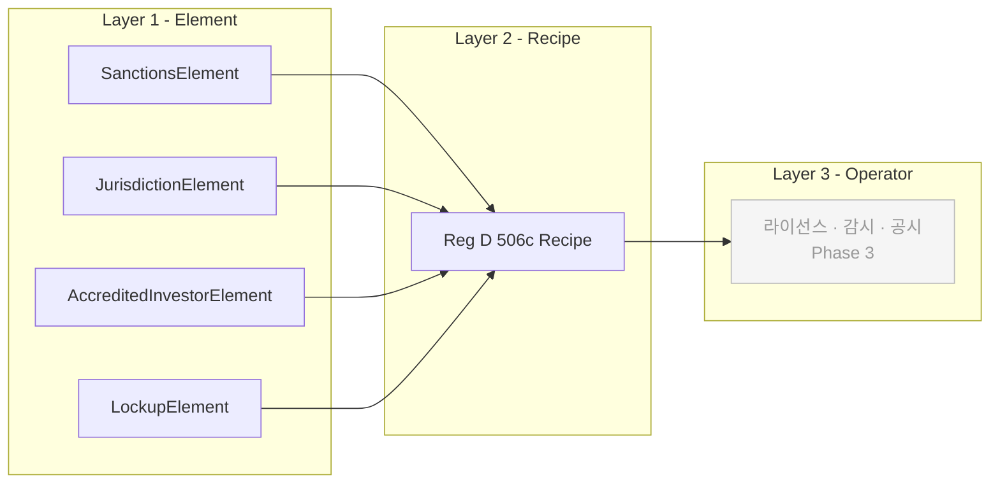

### Layer 1 — Element

단일 규칙 하나만 담당하는 atomic 검증 컨트랙트. 로직 자체는 immutable로 배포하고, 외부 데이터 참조(제재 리스트 주소, 기준값 등)만 mutable reference로 관리.

새 버전이 필요하면 새 Element 컨트랙트를 배포하고 Recipe의 reference만 교체. Recipe 컨트랙트는 유지.

ERC-3643의 발행 측 Compliance 모듈과 책임을 명확히 구분함. 발행 측 모듈은 "이 주소가 이 토큰을 보유할 수 있는가"를 검사하고, Element는 "이 거래가 지금 발생해도 되는가"를 검사.

| Element                   | 검증 내용                   | ERC-3643 중복 여부                       |
| ------------------------- | --------------------------- | ---------------------------------------- |
| SanctionsElement          | OFAC 제재 주소 여부         | 없음 — 거래 측 추가                      |
| JurisdictionElement       | 허용 국가 여부              | CountryAllow와 유사하나 거래 시점 재검증 |
| AccreditedInvestorElement | 적격투자자 여부             | 발행 측과 독립적으로 거래 시 재확인      |
| LockupElement             | Rule 144 보유기간 충족 여부 | 없음 — 거래 측만 가능한 검사             |

### Layer 2 — Recipe

Element들을 조합해 하나의 Regulation을 표현. 새 규제가 생기면 기존 Element를 다시 조립하는 것만으로 대응 가능.

MVP에서 구현하는 Recipe: Reg D 506(c) = SanctionsElement + JurisdictionElement + AccreditedInvestorElement + LockupElement (12개월)

발행자가 토큰 등록 시 사용할 Recipe를 지정하고 Decipher가 검토 후 승인하면 활성화.

### Layer 3 — Operator

DEX 운영주체 단독 책임 영역. 라이선스·시장감시·AML 모니터링·분쟁처리 등 포함. 실제 구현은 Phase 3에서 licensed operator가 담당. MVP에서는 인터페이스 정의만.

---

## 7. 가스비 — Early Exit 패턴

ComplianceRouter를 모든 swap의 진입점으로 두되, ERC-3643 토큰이 아닌 경우 즉시 pool로 패스스루.

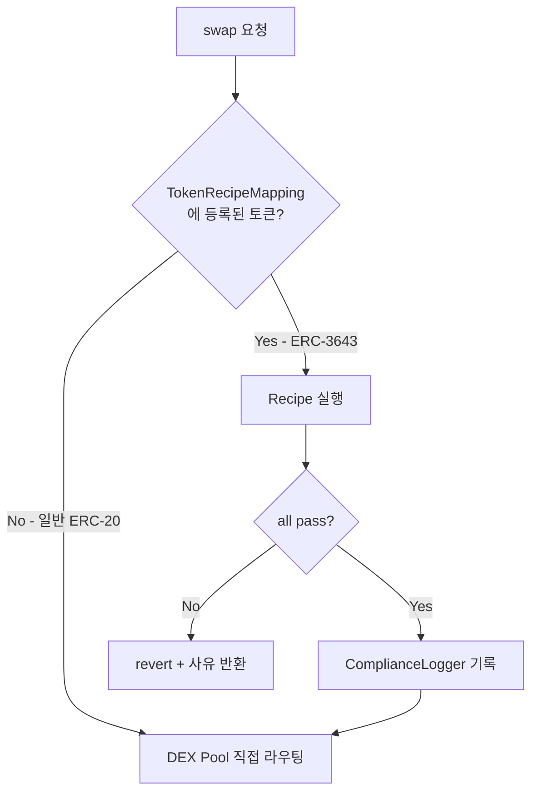

미등록 토큰 경로에서 추가되는 가스는 `TokenRecipeMapping` 조회 한 번(SLOAD warm ~100 gas)뿐. 일반 ERC-20 swap에 사실상 영향 없음.

ERC-3643 경로에서는 Element 개수만큼 외부 호출이 발생하므로 가스가 더 씀. 이건 compliance 비용으로 불가피함.

---

## 8. 토큰 보관 — Pool Custody 구조

### 실제 토큰이 어디에 있는가

Uniswap v3는 콜백 패턴을 사용함. Router가 `Pool.swap()`을 호출하면, Pool이 `uniswapV3SwapCallback`으로 Router를 역호출해서 토큰을 당겨가는 구조. Router는 경유만 하고 보관하지 않음.

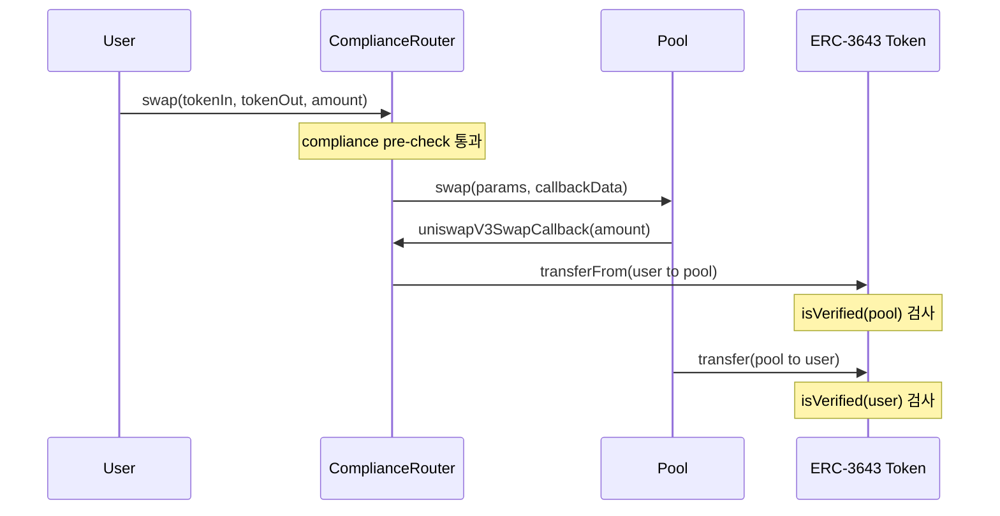

실제로 ERC-3643 토큰을 들고 있는 컨트랙트는 Pool 하나. 따라서 IdentityRegistry에 등록해야 하는 컨트랙트도 Pool뿐.

### 등록이 필요한 주소 목록

| 주소                 | 등록 필요 | 이유                                         |
| -------------------- | --------- | -------------------------------------------- |
| Pool 컨트랙트        | 필요      | 토큰을 실제로 보관하는 custodian             |
| ComplianceRouter     | 불필요    | 토큰을 보관하지 않음 (콜백 경유만)           |
| 투자자 주소          | 필요      | 발행자가 이미 등록 (우리 담당 아님)          |
| NFT Position Manager | 불필요    | LP 포지션은 NFT로 표현, 토큰 직접 보관 안 함 |

### CREATE2 사전 등록 플로우

Uniswap v3 Pool은 CREATE2로 배포되어 주소가 결정론적임. `factory + token0 + token1 + fee`로 배포 전에 주소를 미리 계산할 수 있음. 이를 활용해 배포 전에 등록을 완료할 수 있음.

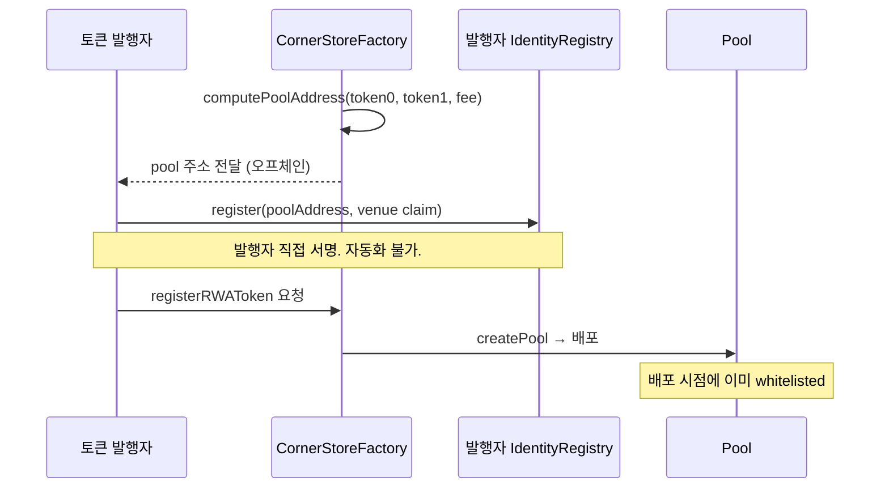

배포 전에 등록이 완료되므로 타이밍 문제 없음. Pool이 배포되는 순간부터 바로 ERC-3643 토큰을 수신할 수 있음.

### LP 유동성 공급 흐름

LP가 유동성을 공급할 때도 동일한 whitelist 구조가 적용됨. LP는 발행자에게 이미 verified 투자자로 등록되어 있어야 하고, Pool은 우리가 venue로 등록. 이 두 조건이 충족되면 `transfer(LP to Pool)` 정상 실행.

유동성 제거 시에도 `transfer(Pool to LP)`. LP가 여전히 verified 상태인지는 발행자 측 IdentityRegistry가 관리.

### Wrapper 방식을 쓰지 않는 이유

일부 프로토콜은 ERC-3643 토큰을 ERC-20 래퍼로 감싸서 AMM 내부에서 자유롭게 거래하게 함. 단, Corner Store는 swap마다 compliance를 검사하는 것이 목적인데, 래퍼로 감싸면 내부에서 자유 거래가 되어 per-trade compliance 목적 자체가 무너짐. 사용하지 않음.

---

## 9. Swap 플로우

### 단일 라우터 진입

일반 ERC-20과 ERC-3643 RWA 토큰 모두 ComplianceRouter를 통해 들어옴. TokenRecipeMapping 조회 결과에 따라 경로가 나뉨.

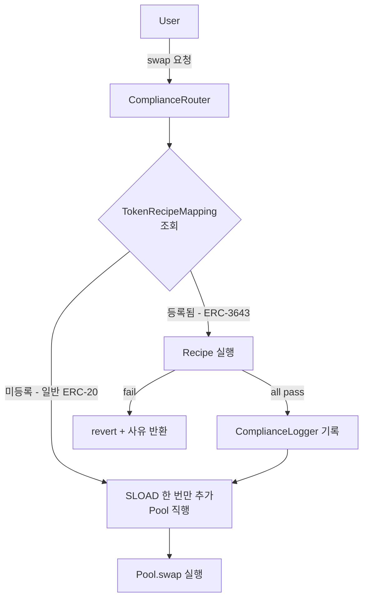

라우터를 분리하면 프론트에서 토큰 타입을 판단해 다른 라우터를 호출해야 함. 단일 라우터 + early exit이 진입점을 하나로 유지하는 가장 깔끔한 구조.

---

### 거래 방향에 따른 Element 적용

Recipe는 `(buyer, seller, tokenIn, tokenOut, amount)`를 모두 받아서 방향을 판단함. 어떤 Element에 누구를 넘길지 Recipe 내부에서 결정.

```
tokenOut = RWA  →  사용자가 RWA를 사는 경우
  buyer = user, seller = pool
  SanctionsElement(buyer)
  JurisdictionElement(buyer)
  AccreditedInvestorElement(buyer)
  LockupElement → pool은 lockup 대상 아님 → skip

tokenIn = RWA  →  사용자가 RWA를 파는 경우
  buyer = pool, seller = user
  SanctionsElement(seller)
  LockupElement(seller)
  AccreditedInvestorElement → USDC 수령자에게 불필요 → skip
```

---

### 전체 Swap 실행 흐름

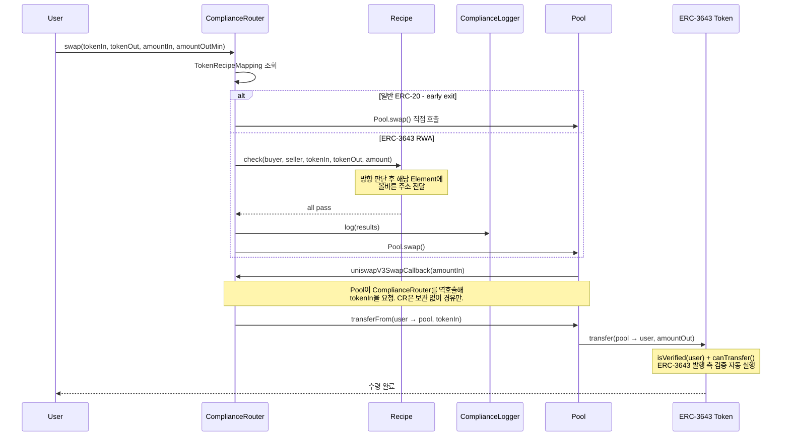

pool에서 user로 tokenOut을 보내는 시점에 ERC-3643의 `isVerified`와 `canTransfer`가 자동으로 한 번 더 돎. pre-check과 별개로 발행 측 compliance가 transfer 레벨에서 한 번 더 검증되는 구조.

### v3 구조상 approve 필요

v3 콜백 패턴에서 ComplianceRouter가 `transferFrom(user → pool, tokenIn)`을 실행하는 주체가 됨. 이 때문에 user가 swap 전에 ComplianceRouter 주소에 대해 tokenIn을 `approve` 해줘야 함. v4 훅 방식이었으면 이 이슈가 없었는데, v3 구조상 불가피함. 프론트엔드에서 approve 트랜잭션을 swap 전에 선행 처리하는 UX가 필요.

---

## 10. CornerStoreFactory

새 토큰이 추가될 때마다 Pool 배포, TokenRecipeMapping 등록, Recipe 할당을 각각 날리면 번거롭고 진입점이 분산됨. Factory 하나에서 일반 ERC-20과 ERC-3643 RWA 토큰을 모두 관리하되, 함수를 명확히 분리하는 구조.

### 단일 Factory로 관리하는 이유

두 경우 모두 내부적으로 동일한 Uniswap Factory를 호출해서 Pool을 만듦. Pool 생성 이후 뭘 더 하느냐만 다름. Factory를 분리하면 Pool 생성 진입점이 두 개가 되어 관리 포인트가 분산되고 프론트 연동도 복잡해짐.

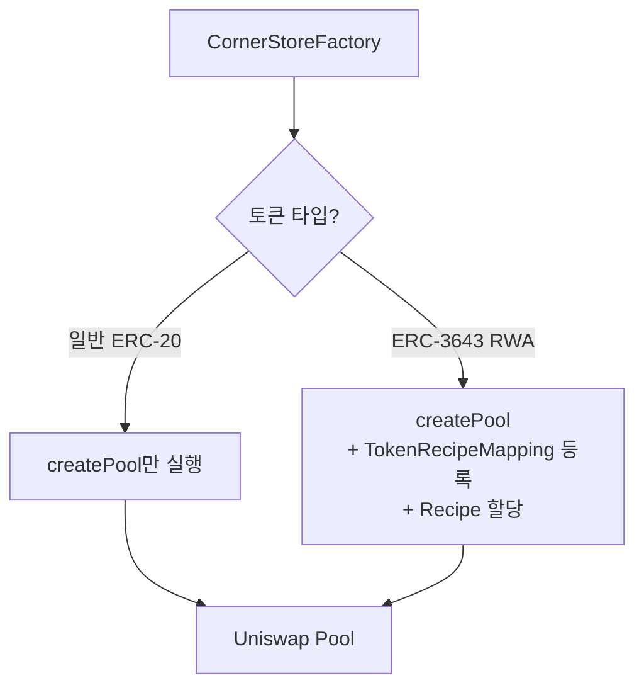

### 함수 구성

```
computePoolAddress(tokenA, tokenB, fee)
  권한: 누구나
  RWA 등록 전 pool 주소를 발행자에게 전달하기 위해 사용.
  상태 변경 없음.

createPool(tokenA, tokenB, fee)
  권한: 누구나
  일반 ERC-20 pool 생성. Uniswap Factory에 위임.
  compliance 셋업 없음.

registerRWAToken(tokenAddress, recipeAddress, quoteToken, fee)
  권한: onlyOwner (Decipher)
  발행자가 IdentityRegistry 등록을 완료한 뒤에만 호출.
  createPool + TokenRecipeMapping + Recipe 할당을 한 트랜잭션에 묶음.

delistToken(tokenAddress)
  권한: onlyOwner (Decipher)
  TokenRecipeMapping에서 해당 토큰 제거.
  이후 swap은 early exit으로 compliance check 없이 통과.
```

### 토큰 등록 플로우

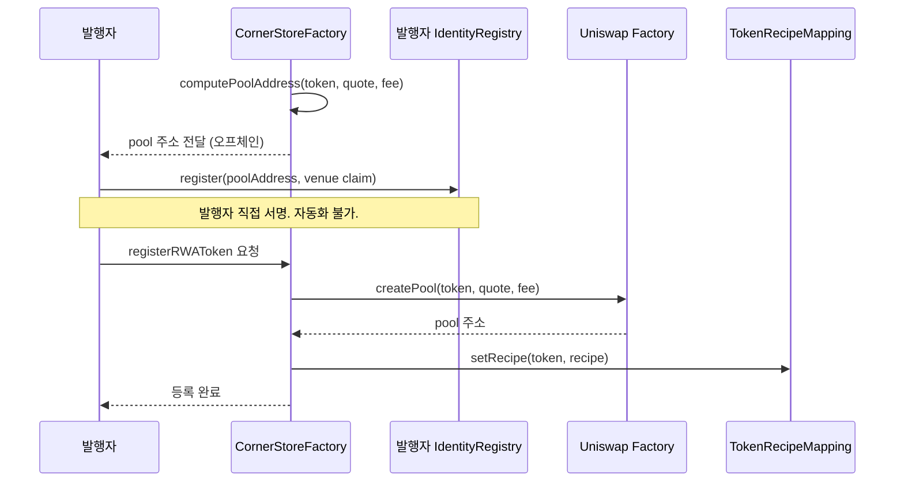

### 토큰별 분리 보장

Factory로 등록된 RWA 토큰들은 각 레이어에서 독립적으로 분리됨.

| 레이어             | 분리 방식                                                                   |
| ------------------ | --------------------------------------------------------------------------- |
| Pool               | token + quoteToken + fee 조합으로 별개 컨트랙트                             |
| TokenRecipeMapping | tokenAddress별 독립 Recipe 매핑                                             |
| Element            | `IERC3643(tokenAddress).identityRegistry()`로 토큰별 레지스트리를 동적 조회 |
| ERC-3643           | 토큰마다 각자 IdentityRegistry · Compliance 컨트랙트 보유                   |

RWA_A의 compliance 설정이 RWA_B에 영향을 주는 경우는 없음.

### RWA-RWA pair

두 토큰이 모두 ERC-3643이면 양쪽 IdentityRegistry에 모두 pool 주소를 등록해야 함. `computePoolAddress`로 나온 주소를 발행자 A, 발행자 B 모두에게 전달하고 양쪽 등록이 완료된 것을 확인한 뒤 `registerRWAToken` 호출.

---

## 11. AMM 커브 교체 가능성

ComplianceRouter는 Pool을 블랙박스로 취급함. `swap()`을 호출하고 콜백으로 tokenIn을 넘겨주면 끝. 내부에서 가격이 어떻게 계산되는지 관심 없음. compliance 로직은 AMM 커브와 완전히 분리되어 있어서 Pool 구현체를 교체해도 Recipe, Element는 건드릴 필요 없음.

단, AMM마다 콜백 인터페이스가 다름. v3는 `uniswapV3SwapCallback`, Curve는 별도 인터페이스. Pool을 추상화해두면 교체 시 ComplianceRouter 수정 없이 Pool 구현체만 바꿔끼울 수 있음.

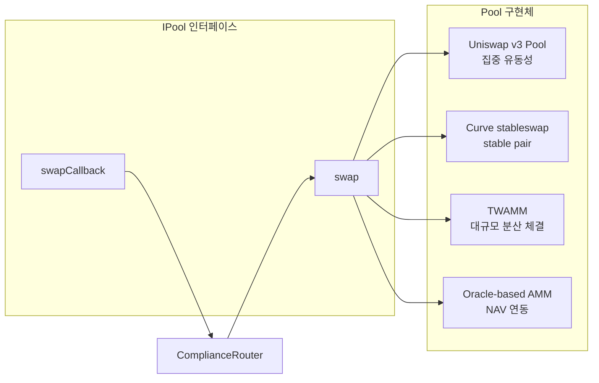

자산 유형에 따라 적합한 커브가 달라짐.

| AMM 커브                 | 적합한 RWA 유형                              |
| ------------------------ | -------------------------------------------- |
| Uniswap v3 (집중 유동성) | 가격 변동이 있는 일반 RWA/USDC pair          |
| Curve stableswap         | 특정 가치에 anchor된 자산 (채권 토큰 등)     |
| TWAMM                    | 기관이 대규모 물량을 시간 분산해서 거래할 때 |
| Oracle-based AMM         | NAV가 외부에서 주어지는 펀드 토큰            |

MVP는 v3로 시작하되, 자산군이 늘어나면 커브를 추가하거나 교체할 수 있는 구조로 가져감.

---

## 12. 컨트랙트별 책임

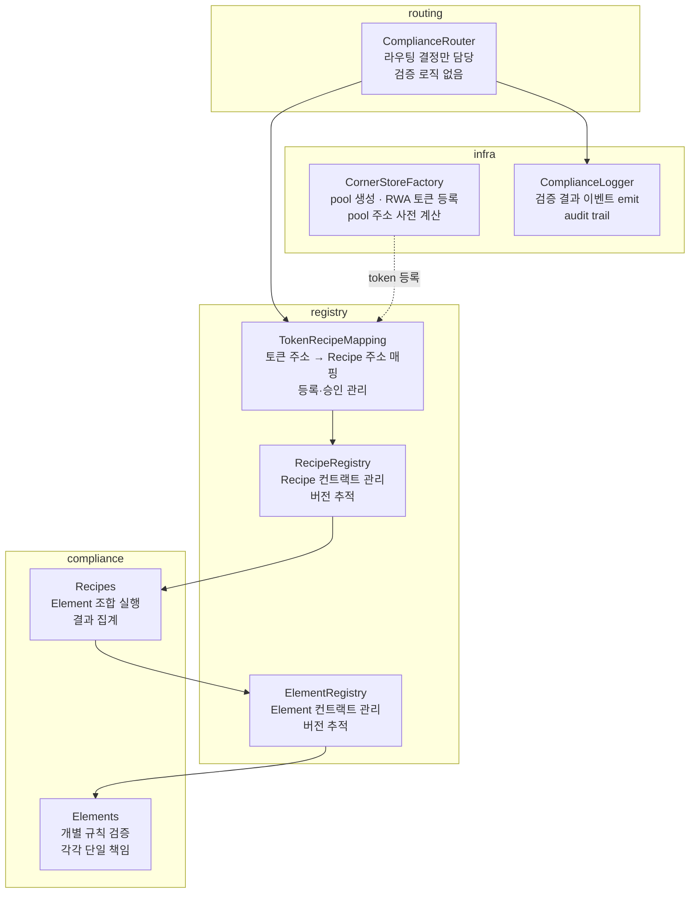

각 컨트랙트가 하는 일과 하지 않는 일을 명확히 구분.

| 컨트랙트           | 책임                            | 책임 아닌 것        |
| ------------------ | ------------------------------- | ------------------- |
| ComplianceRouter   | 토큰 등록 여부 확인 후 라우팅   | 검증 로직 직접 수행 |
| TokenRecipeMapping | 토큰과 Recipe의 연결 관리       | Recipe 실행         |
| RecipeRegistry     | Recipe 컨트랙트 목록 관리       | Element 실행        |
| ElementRegistry    | Element 컨트랙트 목록 관리      | 검증 수행           |
| Elements           | 단일 규칙 하나만 검증           | 다른 규칙 판단      |
| Recipes            | Element 조합 실행 및 결과 집계  | 개별 규칙 구현      |
| CornerStoreFactory | pool 생성 및 RWA 토큰 등록 셋업 | compliance 검증     |
| ComplianceLogger   | 결과 이벤트 기록                | 검증 판단           |

---

## 13. 컨트랙트 구조

```
contracts/
├── factory/
│   └── CornerStoreFactory.sol         # 단일 진입점. 일반 pool + RWA pool 모두 관리.
│
├── routing/
│   └── ComplianceRouter.sol           # 진입점. 라우팅 결정만.
│
├── registry/
│   ├── TokenRecipeMapping.sol          # 토큰 → Recipe 매핑
│   ├── RecipeRegistry.sol              # Recipe 버전 관리
│   └── ElementRegistry.sol             # Element 버전 관리
│
├── elements/
│   ├── IElement.sol
│   ├── SanctionsElement.sol
│   ├── JurisdictionElement.sol
│   ├── AccreditedInvestorElement.sol
│   └── LockupElement.sol
│
├── recipes/
│   ├── IRecipe.sol
│   └── RegD506cRecipe.sol
│
├── logging/
│   └── ComplianceLogger.sol            # 검증 결과 이벤트 emit
│
└── interfaces/
    └── ILayer3Operator.sol             # Phase 3 placeholder
```

---

## 14. DEX 배포 도구

`uniswap/deploy-v3` (GitHub 공개)를 사용하면 Factory, Pool, Router, NFT Position Manager 전체를 any EVM rollup에 CLI 한 줄로 배포 가능. 개발 환경은 Foundry 기준. The Graph subgraph로 swap 이벤트와 compliance 로그 인덱싱.

---

## 15. MVP 스코프

### 만들 것

- GIWA 테스트넷에 Uniswap v3 fork DEX 배포
- CornerStoreFactory (일반 pool + RWA pool 단일 진입점, Pool 배포 + Recipe 할당 자동화)
- ComplianceRouter (early exit 패턴 포함)
- TokenRecipeMapping, RecipeRegistry, ElementRegistry
- Element 4종 (Sanctions, Jurisdiction, AccreditedInvestor, Lockup)
- Reg D 506(c) Recipe
- ComplianceLogger
- 테스트용 Mock ERC-3643 토큰
- 기본 Swap UI (Uniswap Interface fork)

### 만들지 않는 것

- Layer 3 실제 구현 (인터페이스 정의만)
- Reg D 외 다른 규제 Recipe
- 실제 KYC 프로바이더 연동 (mock claim 사용)
- 프로덕션 Oracle
- 보안 감사 (Phase 2 이후)

---

## 16. 기술 스택

| 항목         | 선택                                     |
| ------------ | ---------------------------------------- |
| 체인         | GIWA (OP Stack L2, EVM 호환)             |
| DEX 코어     | Uniswap v3 fork                          |
| 컴플라이언스 | Corner Store (직접 구현)                 |
| 신원/ID      | ERC-3643 · ONCHAINID (재사용)            |
| 개발 환경    | Foundry, Hardhat Ignition                |
| 배포 도구    | uniswap/deploy-v3                        |
| 인덱싱       | The Graph subgraph                       |
| 프론트엔드   | Uniswap Interface fork, wagmi + viem     |
| 언어         | Solidity (컨트랙트), TypeScript (프론트) |
