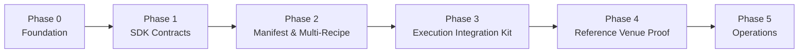

# Corner Store Development Roadmap

> 제품 범위는 [`MVP-v2-multi-venue.md`](./MVP-v2-multi-venue.md), 책임과 trust
> boundary는 [`architecture/`](./architecture/README.md)를 기준으로 한다.
> 이 문서는 구현 순서, 검증 기준과 blocker만 관리한다.

## Current State

완료:

- SDK를 주 제품, Corner Store를 reference DEX로 정의
- Element, Recipe, Manifest, Operator 이름 기반 4-Layer 모델 확정
- cumulative multi-Recipe와 Asset Compliance Manifest 아키텍처 반영
- ERC-3643/ONCHAINID 외부 trust boundary 정의
- AMM, RFQ와 Order Book Adapter 경계 정의
- Uniswap v3 vendored deployment profile 분리와 단위 테스트

미구현:

- 제품 Solidity contracts/interfaces
- mock ERC-3643/identity/compliance fixture
- Element/Recipe/Manifest registry와 evaluation
- generic ExecutionRouter/VenueRegistry와 공통 Adapter interface
- Corner Store reference Adapter
- 자동 integration/E2E
- CI와 static analysis

## Delivery Strategy

첫 testnet proof의 종료점:

1. mock ERC-3643 자산에 `ACTIVE` Manifest를 등록한다.
2. transaction context에 따라 복수 Recipe가 활성화된다.
3. Element 합집합이 cumulative AND로 평가된다.
4. 허용된 engine의 Adapter로만 실행된다.
5. Corner Store 또는 ERC-3643 거부 시 전체 settlement가 원자적으로 실패한다.
6. 명시적 `UNREGULATED` 일반 ERC-20 public path에는 4-Layer 보장이 없고,
   `UNKNOWN` 자산은 거부됨을 테스트한다.
7. mixed pair와 regulated-regulated pair에서 양쪽 Manifest의 적용 정책을 모두
   평가한다.

법률 연구의 41개 Element 전체 구현은 첫 proof의 완료 조건이 아니다. 첫 proof는
법적 정확성을 주장하지 않는 **축약 시뮬레이션 Recipe**로 구조를 증명한다.

## Phase 0 — Foundation

### Goal

Foundry Counter template를 SDK와 reference integration 개발 기반으로 교체한다.

### Deliverables

- 디렉터리와 dependency direction
- 공통 context, IDs, errors와 events
- interface-only SDK package boundary
- mock token, identity, claim, Element와 Adapter fixture
- CI, formatter, build와 test command

### Completion

- template 코드 없이 컴파일된다.
- SDK 공통 컴포넌트가 Uniswap 또는 Corner Store-specific implementation에
  의존하지 않는다.
- mock 허용·거부와 external transfer failure를 재사용할 수 있다.
- `scripts/check.sh`와 CI가 통과한다.

### Blockers

- upgradeability는 별도 결정 전 도입하지 않는다.
- package 배포 형식은 Solidity source/library 형태를 우선하고 TypeScript SDK는
  실제 소비자 요구가 생길 때 결정한다.

## Phase 1 — SDK Contracts

### Goal

Element와 Recipe의 portable interface, registry와 version semantics를 구현한다.

### Deliverables

- `IElement`와 immutable/versioned Element reference
- `IRecipe`와 Recipe metadata/activation interface
- `ElementRegistry`와 `RecipeRegistry`
- transaction compliance context
- reason code와 deterministic evaluation result
- illustrative Element/Recipe fixture

### Completion

- 하나의 Element는 하나의 사실만 평가한다.
- Recipe는 하나의 법률효과와 Element subset을 표현한다.
- 기존 Element를 여러 Recipe가 재사용할 수 있다.
- invalid, inactive 또는 unknown version은 regulated evaluation에서 거부된다.
- 연구에서 제안된 Element 수나 법률 기준값을 production truth로 하드코딩하지
  않는다.

### Interface Decision Gate

IElement 최초 확정 전에 stateful Element commit hook을 결정한다.

선택지:

- check-only interface 후 별도 state transition contract
- `check`와 `commit` 분리
- optional capability interface

어떤 선택이든 failed settlement가 누적 상태를 남기면 안 된다.

## Phase 2 — Manifest and Multi-Recipe

### Goal

자산별 규제·engine binding과 cumulative multi-Recipe evaluation을 구현한다.

### Deliverables

- `ManifestCore`와 Manifest registry/resolver
- proposal, approval, activation, suspension, retirement lifecycle
- Recipe set, resale path, supported engine과 version binding
- issuer-side coverage representation
- applicable Recipe identification
- Element union/deduplication과 cumulative AND
- structured `ComplianceDecision`
- preview/evaluate API와 audit events

### Completion

- 한 Manifest에 복수 Recipe를 binding할 수 있다.
- transaction context에 따라 Recipe subset이 활성화된다.
- 모든 applicable Recipe의 활성 Element가 cumulative AND로 평가된다.
- duplicate Element 최적화가 결과 의미를 바꾸지 않는다.
- decision이 actor, asset, amount, engine/venue, Manifest version, nonce와 expiry에
  바인딩된다.
- `ACTIVE` Manifest의 invalid reference와 unsupported engine은 거부된다.
- `UNKNOWN`, `UNREGULATED` pass-through와 regulated evaluation 결과를 API와
  event에서 구분한다.
- 양쪽 모두 명시적 `UNREGULATED`일 때만 pass-through하고, 하나 이상의 regulated
  자산이 있으면 양쪽 regulated Manifest의 applicable Recipe를 합쳐 평가한다.
- full off-chain manifest hash와 on-chain core의 version 변경이 추적된다.

### Blocking Design Decisions

1. Rule 144 holding period를 위한 acquisition/lot data source
2. Manifest scope: token 또는 token×venue
3. Recipe set와 issuer coverage encoding
4. reject audit trail

acquisition data가 필요한 Recipe는 data source가 결정되기 전 활성화하지 않는다.

## Phase 3 — Execution Integration Kit

### Goal

제3의 DEX도 재사용할 수 있는 generic Router와 Adapter 등록·dispatch 경계를
구현한다.

### Deliverables

- `ExecutionRouter`
- `VenueRegistry`와 최소 deterministic selector
- 공통 Adapter interface
- Adapter registration/dispatch
- nonce, deadline와 replay protection
- execution events
- `UNKNOWN`, explicit `UNREGULATED`와 regulated path의 명시적 분기

### Completion

- 미등록·중단 Adapter, venue와 operator로 실행할 수 없다.
- settlement 직전에 Manifest와 actor/operator 상태를 평가한다.
- preview decision을 실행 권한으로 재사용할 수 없다.
- request와 decision mismatch, expiry와 nonce reuse가 거부된다.
- Router에 의도하지 않은 자산 잔액이 남지 않는다.
- 직접 venue 호출에는 Corner Store 4-Layer 보장이 없음을 테스트한다.
- mock Adapter를 교체·등록·중단해도 Router와 compliance policy 코드를 수정하지
  않는다.

### Non-goals

- best execution
- order splitting
- venue-native matching
- production operator governance

## Phase 4 — Reference Venue Proof

Corner Store reference DEX의 구체 Venue는 공통 SDK/Router 기반 위에서 독립적으로
구현한다.

### 4A. Uniswap v3 AMM

Deliverables:

- `UniswapV3Adapter`
- factory, pool과 callback verification
- Manifest engine/venue binding
- CREATE2 pool identity preflight
- Corner Store deploy-v3 profile integration
- automated Anvil deployment and swap test

Completion:

- 허용 Manifest/Recipe scenario의 swap이 성공한다.
- unsupported engine, failing Element와 ERC-3643 transfer가 전체 swap을 되돌린다.
- spoof callback과 미등록 pool이 거부된다.
- Adapter balance invariant가 유지된다.
- 명시적 `UNREGULATED` 일반 ERC-20 public path가 별도 보장 수준으로 성공한다.
- unregulated-regulated mixed pair와 regulated-regulated pair가 양쪽 Manifest
  규칙을 모두 적용한다.

Blockers:

- initial testnet asset/scenario
- fee tier와 Pool IdentityRegistry onboarding
- 해당 시나리오의 AMM 허용에 대한 법률 검토

### 4B. RFQ

Status: v1 reference settlement implemented; production dealer and custody
decisions remain open.

Deliverables:

- EIP-712 quote
- signature, nonce, expiry와 taker binding
- Router-only RFQ Adapter와 latest compliance evaluation
- 최소 TypeScript quote signer reference service
- partial fill policy는 v1 non-goal로 유지

Completion:

- invalid signer, replay와 expired quote가 거부된다.
- Manifest/Recipe 또는 operator 변경이 fill에 반영된다.
- signed quote와 request amount가 정확히 일치한다.

Blockers:

- dealer/operator approval
- exact taker 또는 taker class
- custody와 partial fill 모델

### 4C. Order Book

Deliverables:

- signed order, cancellation, expiry와 fill accounting
- matcher/operator validation
- Order Book Adapter와 settlement event

Completion:

- cancelled/expired order를 fill할 수 없다.
- 각 fill 직전에 최신 Manifest evaluation을 수행한다.
- total fill이 order amount를 초과하지 않는다.

Blockers:

- on-chain/off-chain matching
- custody/escrow
- surveillance responsibility

## Phase 5 — Deployment and Operations

### Goal

SDK와 reference DEX를 반복 배포하고 Manifest/권한 상태를 검증 가능하게 운영한다.

### Deliverables

- integrated deployment orchestrator
- deployment manifest와 schema validation
- source/code/config verification
- role handoff와 multisig integration
- indexer, monitoring와 incident runbook
- Manifest proposal/approval workflow

### Completion

- clean environment 배포와 partial failure recovery가 재현된다.
- deployment manifest와 on-chain code/config/roles가 일치한다.
- deployer 임시 권한이 제거된다.
- Manifest activation/suspension incident drill을 수행한다.
- reject logging 결정에 따른 audit path를 검증한다.

### Blockers

- production chain
- operator와 legal responsibility
- governance/key management
- production security and legal review

## Near-Term Issues

구현 전에 생성할 가까운 이슈:

1. `chore: SDK와 reference DEX용 Foundry 제품 구조 구성`
2. `feat: compliance context와 Element/Recipe interface 정의`
3. `test: mock ERC-3643 identity와 adapter fixture 구성`
4. `design: stateful Element commit hook 결정`
5. `design: acquisition data source 결정`
6. `feat: Asset Compliance Manifest lifecycle 구현`
7. `feat: cumulative multi-Recipe evaluation 구현`
8. `feat: structured decision과 ExecutionRouter dispatch 구현`
9. `test: regulated/public path와 direct venue boundary E2E`

## Decision Backlog

| 결정 | 영향 Phase | 결정 전 기본값 |
| --- | --- | --- |
| acquisition/lot source | 2 | 해당 holding-period Recipe 비활성 |
| Element commit hook | 1 | stateful Element 구현 보류 |
| Manifest scope | 2 | 결정 전 external API와 storage 확정 금지 |
| Manifest 공개 범위 | 2, 5 | full document는 off-chain, 공개 필드는 미정 |
| reject audit trail | 2, 5 | 방식 확정 전 production claim 금지 |
| initial engine/scenario | 4 | 법률 검토된 illustrative scenario만 활성 |
| production operator/governance | 5 | test-only admin, production 배포 금지 |

## Definition of Done

각 phase는 다음 조건을 모두 만족해야 완료다.

- 관련 interface와 invariant가 문서화됨
- unit/integration/E2E 중 해당 layer 검증 통과
- 보안·권한·replay·failure path 검증
- current source-of-truth와 구현 용어가 일치
- 열린 법률 결정을 확정된 코드 규칙처럼 표현하지 않음
- `scripts/check.sh` 통과
