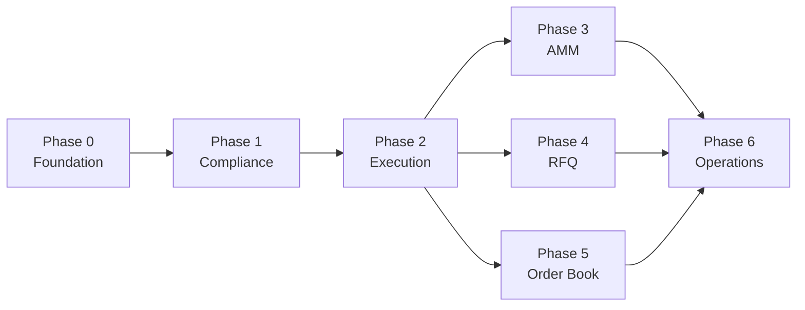

# Corner Store Development Roadmap

> 제품 범위는 [`MVP-v2-multi-venue.md`](./MVP-v2-multi-venue.md), 책임과
> trust boundary는 [`architecture/`](./architecture/README.md)를 기준으로 한다.
> 이 문서는 구현 순서와 완료 판단만 관리한다.

## Current State

완료:

- AMM 중심 v1에서 multi-venue v2로 아키텍처 전환
- Token/Identity, Compliance, Execution, Venue 책임 경계 정의
- Uniswap `deploy-v3` vendoring
- upstream 전체 단계와 Corner Store 최소 배포 profile 분리
- 최소 profile 단위 테스트 및 수동 Anvil 배포 검증

미구현:

- 제품 Solidity 컨트랙트
- mock ERC-3643/identity/compliance test fixture
- CI와 정적 분석
- 자동 통합 배포 및 manifest
- AMM/RFQ/Order Book Adapter
- end-to-end compliance execution test

## Delivery Path

Phase 0~3이 첫 번째 end-to-end delivery path다. RFQ와 Order Book은 Execution
기반을 공유하지만 서로 독립적으로 진행한다. 결정되지 않은 venue는 등록하거나
활성화하지 않는다.

이 첫 번째 delivery path가 **MVP v1**이다. 종료점은 AMM 거래가 허용된 illustrative
mock policy의 방향별 성공과, 금지된 방향 또는 ERC-3643/Layer 1~2 policy 거부
시나리오의 원자적 실패다.
RFQ schema와 Adapter interface는 다음 릴리스의 interface-only 범위다. RFQ
settlement, Order Book과 Layer 3 운영체계는 후속 범위다.

## Phase 0 - Foundation

목표:

- Foundry template를 제품 개발 기반으로 교체한다.

산출물:

- 제품 디렉터리 구조
- 공통 execution/compliance types, interfaces, errors, events
- mock token, identity, compliance, adapter fixture
- format, build, test, CI 명령

완료 조건:

- template 코드 없이 컴파일된다.
- mock 허용·거부 시나리오를 재사용할 수 있다.
- `forge fmt`, `forge build`, `forge test`가 CI에서 통과한다.

Blocker:

- upgradeability를 도입하지 않는다. 필요 시 별도 결정 후 진행한다.

## Phase 1 - Compliance Policy

목표:

- 자산·프로그램 정책을 versioning하고 구조화된 decision을 생성한다.

산출물:

- TokenPolicy, Recipe, Element, Operator Registry
- ComplianceEngine
- `ComplianceDecision`과 context binding
- illustrative Legal-to-Technical Matrix
- 최소 관리 capability와 권한 분리 경계
- registration, activation, suspension, emergency pause lifecycle
- compliance audit events

완료 조건:

- mock Recipe로 허용과 거부를 재현한다.
- `UNKNOWN`, `SUSPENDED`, delisted 상태는 fail-closed다.
- decision을 다른 actor, token, amount, venue, version에 재사용할 수 없다.
- exact venue 또는 허용 venue 집합이 decision에 바인딩된다.
- policy 변경 후 이전 version의 preview/decision은 실행 권한으로 사용할 수 없다.
- mixed pair에서 한쪽이라도 `ACTIVE`면 전체 거래 context가 해당 policy로 평가된다.
- illustrative Recipe의 각 requirement가 evidence, Element, data source,
  enforcement point, failure action과 연결된다.
- policy 변경, venue/operator 관리, emergency pause capability가 실행 권한과
  구분된다.

Blocker:

- production Element와 법률 기준값은 법률 승인 전 활성화하지 않는다.
- MVP v1의 Layer 2 보장은 `ExecutionRouter` 지원 경로에 한정한다. 표준 pool 직접
  호출에는 ERC-3643 transfer enforcement만 적용되며 Corner Store policy 적용을
  보장하지 않는다.
- 비우회 Layer 2 enforcement가 법률상 필요한 production RWA venue는 enforcement
  방식과 외부 승인이 확정되기 전 활성화하지 않는다.
- 실제 법률 책임자, 운영조직과 관리자 구성은 Layer 3 외부 협업 범위로 둔다.
- 최종 delist 판단과 권한은 Layer 3 운영 범위로 두며 MVP에서는 suspension과
  신규 실행 거부만 구현한다.

## Phase 2 - Execution & Routing

목표:

- 유효한 decision만 등록 Adapter로 전달한다.

산출물:

- ExecutionRouter
- VenueRegistry와 최소 VenueSelector
- Adapter registration/dispatch
- nonce, deadline, replay protection
- execution events

완료 조건:

- 미등록·중단 Adapter와 venue 실행이 불가능하다.
- 만료·재사용·parameter mismatch 요청이 거부된다.
- 실제 execution/fill 트랜잭션에서 최신 policy version과 actor 상태를 평가한다.
- Router에 의도하지 않은 자산 잔액이 남지 않는다.

Blocker:

- best execution, order splitting, venue matching을 이 phase에 포함하지 않는다.

## Phase 3 - Uniswap v3 AMM

목표:

- 첫 번째 실제 venue로 Uniswap v3를 연결하고 mock ERC-3643과 일반 ERC-20 거래를
  E2E 검증한다.

산출물:

- UniswapV3Adapter
- factory, pool, callback 검증
- CREATE2 pool identity preflight와 venue onboarding
- deploy-v3 Corner Store profile 호출 경로
- versioned deployment manifest
- 자동 Anvil 배포 및 swap test

완료 조건:

- V3와 Corner Store 컴포넌트를 반복 배포할 수 있다.
- mock ERC-3643/ERC-20 Pool에서 policy가 허용한 매수·매도 방향은 성공하고 금지한
  방향은 거부된다.
- 명시적 `UNREGULATED` 일반 ERC-20 경로의 AMM swap이 성공한다.
- 허용, execution 거부, transfer 거부 swap이 자동 테스트된다.
- 미검증 사용자의 mock ERC-3643 수신이 거부되고 전체 swap이 롤백된다.
- spoof callback과 미등록 pool이 거부된다.
- 지원 진입점에서는 Layer 2 policy가 적용되고, 직접 pool 호출에서는 Layer 2
  보장이 없으며 ERC-3643 transfer 결과만 적용된다는 경계가 자동 테스트된다.
- Adapter 잔액 불변성이 유지된다.

Blocker:

- fee tier와 Pool IdentityRegistry 등록 절차 합의
- deploy-v3 호출 API는 이 phase의 실제 orchestrator와 함께 설계

## Phase 4 - RFQ

목표:

- signed quote를 settlement 시점 compliance와 함께 실행한다.

산출물:

- EIP-712 quote schema
- signature, nonce, expiry, taker 검증
- RFQAdapter와 settlement
- operator/dealer validation

완료 조건:

- invalid signer, replay, 만료 quote가 거부된다.
- policy 변경과 operator suspension이 fill에 반영된다.
- 허용된 fill 총합이 quote amount를 초과하지 않는다.

Blocker:

- dealer 승인, partial fill, custody 모델 결정

## Phase 5 - Order Book

목표:

- 결정된 matching/custody 모델로 order lifecycle과 settlement를 구현한다.

산출물:

- order schema, nonce, expiry, cancellation
- matcher/operator validation
- partial fill accounting
- OrderBookAdapter와 surveillance events

완료 조건:

- 취소·만료 order를 fill할 수 없다.
- total fill이 order amount를 초과하지 않는다.
- 각 fill 직전에 maker/taker compliance를 재검증한다.

Blocker:

- on-chain/off-chain matching과 escrow/custody 모델 결정 전 구현 보류

## Phase 6 - Deployment & Operations

목표:

- 출시 범위의 컴포넌트를 반복 배포하고 운영할 수 있게 한다.

산출물:

- 통합 deployment orchestrator와 immutable manifest
- preflight/post-deploy verification
- multisig/role handoff
- source verification
- indexer, monitoring, incident runbook
- production security review scope

완료 조건:

- clean environment 배포와 부분 실패 복구가 재현된다.
- manifest와 on-chain code/config/owner가 일치한다.
- deployer 임시 권한이 제거된다.
- pause/delist incident drill을 수행한다.

Blocker:

- production chain, governance, key management, 법률 출시 조건 결정

## Near-Term Issues

가까운 작업만 구체적인 이슈로 생성한다.

1. `chore: Foundry 제품 구조와 CI 검증 기반 구성`
2. `feat: execution 및 compliance 공통 타입과 인터페이스 정의`
3. `test: mock ERC-3643 identity와 compliance fixture 구성`
4. `docs: illustrative Legal-to-Technical Matrix와 Layer 2 보장 범위 정의`
5. `feat: TokenPolicyRegistry 상태와 버전 관리 구현`
6. `feat: Recipe 및 Element 실행 경계 구현`
7. `feat: Operator 및 Venue Registry 구현`
8. `feat: ComplianceEngine과 구조화된 decision 구현`
9. `feat: ExecutionRouter와 Adapter dispatch 구현`

AMM 세부 이슈는 Phase 2 인터페이스가 안정화된 후 생성한다. RFQ와 Order Book은
각 blocker가 해결된 뒤 issue scope를 확정한다.

## Decision Backlog

| 결정                           | 영향 Phase | 결정 전 기본값              |
| ------------------------------ | ---------- | --------------------------- |
| production Element와 규제 기준 | 1          | mock만 사용, policy 비활성  |
| pause/policy 관리자            | 1, 6       | production 활성화 보류      |
| 최종 delist 판단과 권한        | 6          | suspension과 신규 실행 거부 |
| 일반 ERC-20 fast path          | 1, 2       | 명시적 `UNREGULATED`만 허용 |
| production AMM 비우회 enforcement | 3, 6    | 외부 승인 전 RWA venue 비활성 |
| AMM fee tier                   | 3          | 승인된 기본 tier만          |
| Pool identity 등록 절차        | 3          | 등록 확인 전 venue 비활성   |
| RFQ dealer와 custody           | 4          | 미등록 거부, 구현 보류      |
| RFQ partial fill               | 4          | exact fill                  |
| Order Book matching/custody    | 5          | 구현 보류                   |
| upgradeability와 governance    | 0, 6       | immutable 우선              |
| production chain과 signer      | 6          | Anvil/testnet만 지원        |

결정은 해당 아키텍처 레이어 문서의 `Open Decisions`와 함께 갱신한다.

## Global Completion Rules

- 각 phase의 코드, 테스트, 문서를 같은 PR 또는 연결된 PR에서 완료한다.
- 실패한 검증이 있으면 phase를 완료로 표시하지 않는다.
- 미확정 정책을 permissive placeholder로 활성화하지 않는다.
- Layer 2 기술 capability를 Layer 3 운영·법률 책임의 구현으로 표현하지 않는다.
- 아키텍처 책임이 바뀌면 먼저 관련 레이어 문서와 `MVP-v2`를 갱신한다.
- 배포 범위가 바뀌면 `CORNER_STORE_PROFILE.md`와 manifest schema를 갱신한다.
