# Corner Store Technical Whitepaper

> **Composable Compliance Execution for ERC-3643 Markets**  
> Version 0.2 · July 2026 · Technical Whitepaper  
> Status: public technical draft · Repository implementation snapshot

Corner Store는 ERC-3643 기반 규제 자산이 탈중앙 거래 환경에서 거래될 때,
**어떤 정책을 적용하고 어느 실행 경로에서 이를 강제할지**를 구성·검증할 수 있게
하는 Solidity SDK와 reference execution system이다.

이 문서는 Corner Store의 제품 아키텍처, 정책 모델, RFQ 실행 구조, 보안 경계,
통합 방식과 현재 구현 상태를 설명한다. 법률 의견서나 특정 관할권의 규제 적합성
인증서가 아니며, production 정책은 발행사·Transfer Agent(TA)·법률 자문과
운영 주체의 승인을 거쳐야 한다.

### Document Status

| 항목 | 내용 |
| --- | --- |
| 문서 목적 | 제품 목적, 아키텍처, 구현과 production 경계를 외부 이해관계자에게 설명 |
| 구현 기준 | 2026년 7월 repository와 accepted ADR |
| 기술 상태 | SDK/reference implementation; production certification 아님 |
| 법률 상태 | illustrative mapping; 법률 의견 또는 상품 적합성 승인 아님 |
| 우선순위 | 충돌 시 source code, architecture spec, accepted ADR, 본 백서 순 |

---

## Table of Contents

1. [Executive Summary](#1-executive-summary)
2. [Problem: Transfer Compliance Is Not Market Compliance](#2-problem-transfer-compliance-is-not-market-compliance)
3. [Product Architecture](#3-product-architecture)
4. [Composable Policy Model](#4-composable-policy-model)
5. [Recipe Binding Semantics](#5-recipe-binding-semantics)
6. [Protected Execution Flow](#6-protected-execution-flow)
7. [Token Classification and Pair Evaluation](#7-token-classification-and-pair-evaluation)
8. [Execution Venue Model](#8-execution-venue-model)
9. [Modular RFQ Backend](#9-modular-rfq-backend)
10. [On-chain and Off-chain Boundary](#10-on-chain-and-off-chain-boundary)
11. [Security Model](#11-security-model)
12. [Developer and Operator Experience](#12-developer-and-operator-experience)
13. [Reference Demonstration](#13-reference-demonstration)
14. [Current Implementation Status](#14-current-implementation-status)
15. [Production Readiness and Roadmap](#15-production-readiness-and-roadmap)
16. [Design Principles](#16-design-principles)
17. [Conclusion](#17-conclusion)
18. [Glossary](#18-glossary)
19. [Sources and References](#19-sources-and-references)

---

## 1. Executive Summary

ERC-3643은 identity registry와 compliance contract를 이용해 규제 자산의 전송
가능성을 토큰 레이어에서 통제한다. 그러나 실제 시장에서는 단순한
`from → to` 전송 외에도 다음 정보가 필요하다.

- 어느 자산을 어떤 자산과 교환하는가
- AMM, RFQ, Order Book 중 어느 venue를 사용하는가
- 투자자와 Maker가 체결 시점에도 유효한 자격을 갖는가
- 투자 한도, 보유 기간, 관할권, 가격·수량 같은 거래 context가 정책을 만족하는가
- 견적 발급 후 claim 또는 Maker 승인이 바뀌었는가
- 정책 실패 이후에도 다른 경로로 같은 거래를 우회할 수 있는가

Corner Store는 이 문제를 두 개의 확장 축으로 분리한다.

1. **Policy plugins** — Element, Recipe, Manifest를 조합해 자산별 시장 접근
   정책을 정의한다.
2. **Execution plugins** — Router와 Adapter 경계를 통해 AMM, RFQ, 향후
   Order Book 또는 외부 DEX를 연결한다.

모든 Router-mediated 거래는 체결 직전에 최신 정책을 평가한다. Pre-check나
서명된 RFQ quote는 체결을 보장하지 않는다. 최종 상태가 달라졌다면 Router는
거래를 거부하고 자산 이동을 원자적으로 막는다.

> **핵심 가치**  
> ERC-3643이 token transfer eligibility의 기반이라면, Corner Store는
> **market access eligibility를 실행 시점에 표현하고 집행하는 기반**이다.

### 1.1 한눈에 보는 제품

| 구분 | Corner Store가 제공하는 것 |
| --- | --- |
| 정책 모델 | Element → Recipe → Manifest로 이어지는 조합형 규칙 |
| 실행 경계 | ComplianceEngine을 반드시 호출하는 ExecutionRouter |
| Venue 확장 | 공통 Adapter 인터페이스와 AMM/RFQ reference adapter |
| RFQ 통합 | EIP-712 quote, maker/signer authorization, replay protection |
| 개발자 경험 | Solidity scaffold, TypeScript SDK, Toolkit, CLI |
| 배포 경험 | local Deployment Studio, dry-run, artifact verification |
| 운영 가시성 | read-only Operator API와 reference dashboard |
| 검증 | Foundry unit/integration tests와 Anvil end-to-end scenarios |

### 1.2 Corner Store가 아닌 것

- KYC 또는 신원 증명 발급 서비스가 아니다.
- ERC-3643 토큰이나 ONCHAINID를 대체하지 않는다.
- 법률 판단을 자동으로 생성하는 시스템이 아니다.
- 모든 ERC-20 이동을 전역적으로 통제하는 프로토콜이 아니다.
- 현재 상태에서 production-ready 거래소 전체를 제공하지 않는다.

Corner Store의 보장은 **Corner Store Router를 통과하도록 구성된 실행 경로**에
적용된다. 직접 token transfer, 직접 venue 호출, wrapper 또는 외부 장부는 별도
통제와 감시가 필요하다.

### 1.3 Project Purpose

Corner Store의 목적은 “규제 문서를 자동으로 코드로 바꾸는 것”이 아니다.
프로젝트가 해결하려는 문제는 이미 승인된 규제·운영 판단을 **반복 가능하고
검증 가능한 실행 정책**으로 연결하는 것이다.

이를 위해 다음 결과를 목표로 한다.

1. **정책 재사용** — 자산마다 Router 또는 venue contract를 다시 작성하지 않는다.
2. **일관된 집행** — AMM과 RFQ가 동일한 Manifest와 evaluation semantics를 사용한다.
3. **최신 상태 강제** — 견적이나 주문 생성 이후 상태가 바뀌어도 체결 직전에
   다시 판단한다.
4. **명시적 책임 경계** — issuer/TA, token, DEX operator, Maker와 protocol이
   무엇을 신뢰하고 무엇을 책임지는지 구분한다.
5. **통합 비용 감소** — SDK, Adapter interface, Toolkit과 conformance test를
   이용해 후속 자산·venue 통합 비용을 낮춘다.
6. **감사 가능성** — 정책 version, reason, execution과 governance evidence를
   연결할 수 있게 한다.

### 1.4 Intended Readers and Adoption Roles

| 독자 또는 통합 주체 | 백서에서 확인할 내용 |
| --- | --- |
| Token issuer / TA | 기존 ERC-3643 claim과 Corner Store Manifest의 책임 경계 |
| DEX / tokenization platform | Router·Adapter 통합 방식과 우회 방지 범위 |
| RFQ operator / dealer | quote, pricing, risk, signer, nonce의 분리 |
| Security reviewer | 불변식, trust boundary, replay와 direct-call 통제 |
| Legal / compliance reviewer | 법률 판단과 기술 binding 사이의 승인 지점 |
| Infrastructure operator | deployment artifact, Safe, monitoring과 incident 경계 |
| Partner / investor | Corner Store가 만드는 재사용 가능한 제품 가치와 현재 성숙도 |

### 1.5 Success Criteria

Corner Store의 성공은 하나의 reference DEX 거래량이 아니라 다음 재사용성으로
판단한다.

- 제3의 통합자가 공통 Router를 수정하지 않고 새 Adapter를 연결할 수 있는가
- 새 자산이 검토된 Recipe를 Manifest로 조합해 onboarding될 수 있는가
- 동일한 정책이 여러 venue에서 같은 의미로 평가되는가
- 실패가 reason과 policy version으로 설명되고 자산 이동은 원자적으로 방지되는가
- local fixture를 production input으로 교체할 경계가 명확한가

---

## 2. Problem: Transfer Compliance Is Not Market Compliance

ERC-3643은 permissioned token, Identity Registry, trusted issuer와
`canTransfer` 기반 compliance interface를 정의한다
([ERC-3643 specification](https://eips.ethereum.org/EIPS/eip-3643),
[official compliance framework](https://docs.erc3643.org/erc-3643/overview-of-the-protocol/built-in-compliance-framework)).
Corner Store는 이 기능을 부족하다고 전제하거나 대체하지 않는다. 규제 토큰의
전송 가능 여부만으로 DEX 거래의 전체 market context를 항상 설명할 수 없다는
통합 문제를 다룬다.
예를 들어 동일한 투자자와 토큰이라도 다음 거래는 서로 다른 결론을 가질 수 있다.

- 발행 단계의 최초 배정과 2차 거래
- 승인된 RFQ Maker와 미승인 상대방
- 보유 기간이 끝나기 전과 후
- 허용된 관할권과 제한된 관할권
- 한도 이하의 매수와 한도를 넘는 매수
- 견적 시점에는 유효했지만 체결 시점에는 만료된 claim

DEX가 개별 정책을 Router, pool, backend마다 직접 구현하면 정책이 중복되고
서로 다른 버전으로 분기된다. 반대로 token contract에 모든 시장 context를 넣으면
토큰이 특정 거래소 구현에 결합되고 업그레이드와 법률 변경에 취약해진다.

Corner Store는 다음 책임을 분리한다.

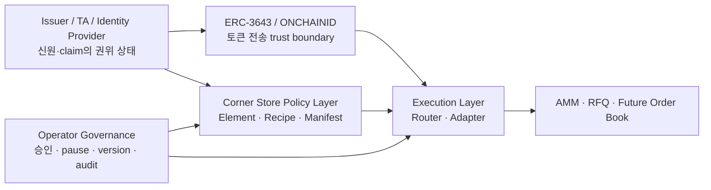

- **Issuer/TA/Identity Provider**는 신원과 claim의 사실 출처다.
- **ERC-3643/ONCHAINID**는 token-level transfer eligibility를 담당한다.
- **Corner Store Policy Layer**는 시장 접근 정책을 구성한다.
- **Execution Layer**는 거래 context를 최신 정책과 결합해 체결을 통제한다.
- **Operator Governance**는 정책 버전, 권한, emergency control과 증거를
  관리한다.

### 2.1 Why a Separate Execution Layer?

모든 DEX-specific 정보를 ERC-3643 token compliance module에 넣는 방식은
가능하지만 다음 결합을 만든다.

- token이 특정 venue, Router 또는 quote format을 알아야 한다.
- DEX 운영 정책 변경이 issuer token upgrade 또는 module 변경으로 이어진다.
- 여러 DEX가 서로 다른 구현으로 같은 법률 판단을 중복한다.
- Maker 승인, quote nonce, venue pause처럼 token transfer와 다른 상태가 섞인다.

반대로 DEX backend만 검사하면 사용자가 contract를 직접 호출하거나 quote 이후
상태가 바뀌었을 때 우회될 수 있다. Corner Store는 issuer의 token-level 검사를
그대로 유지하면서, **시장 context는 Router-mediated execution layer에서
추가로 집행**한다.

### 2.2 Core Requirements

이 문제 정의에서 다음 기술 요구사항이 도출된다.

| 요구사항 | 설계 응답 |
| --- | --- |
| 자산별 정책 조합 | Manifest + bounded `RecipeBinding[]` |
| venue별 구현 차이 | 공통 Adapter interface |
| quote 이후 상태 변경 | fill-time fresh evaluation |
| 직접 Adapter 우회 | Router-only authorization |
| mixed regulated pair | tokenIn/tokenOut 양쪽 누적 평가 |
| 법률·PII 온체인 노출 방지 | compact fact + off-chain hash/reference |
| 실패 후 상태 오염 방지 | evaluate → settlement → commit |
| 운영 변경 추적 | lifecycle, version, timelock, reason/evidence |

---

## 3. Product Architecture

Corner Store는 Compliance Core와 Execution Integration Kit을 분리한다.

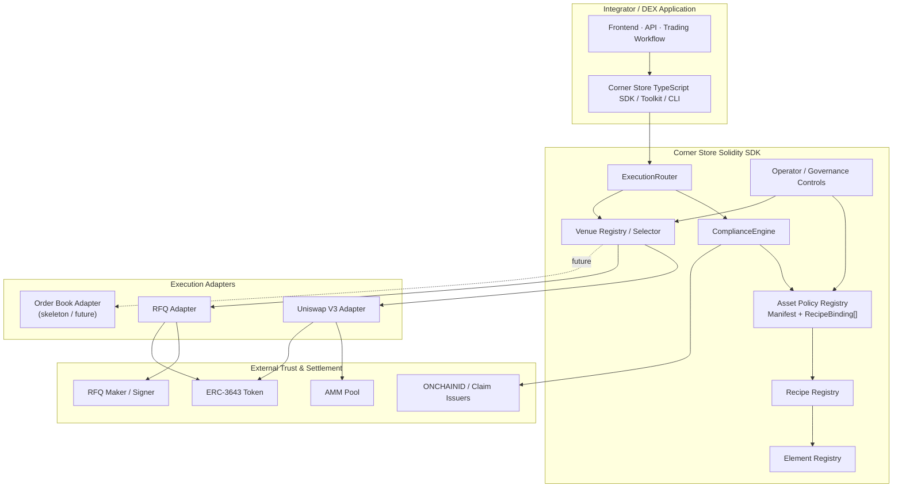

### 3.1 Compliance Core

Compliance Core는 특정 DEX의 가격 결정이나 주문 매칭을 알지 않는다. 대신 다음을
담당한다.

- 자산 분류와 Manifest lifecycle
- Recipe binding과 조합 규칙
- Element별 fact evaluation
- 구조화된 allow/reject/flag decision
- 상태형 정책의 pre-check와 post-settlement commit
- reason code와 정책 버전의 추적

### 3.2 Execution Integration Kit

Execution Integration Kit은 거래 요청을 정책 context로 변환하고 허용된
venue로 전달한다.

- Router request binding
- deadline, nonce와 replay protection
- tokenIn/tokenOut 양측 정책 평가
- 승인된 Adapter와 venue 선택
- settlement 후 compliance state commit

Adapter는 venue별 calldata, 서명, pool 또는 inventory settlement를 검증하지만
자산의 법률 정책을 자체적으로 소유하지 않는다.

### 3.3 Control Plane and Execution Plane

Corner Store는 자주 실행되는 거래 경로와 느리게 변경되는 정책·운영 경로를
분리한다.

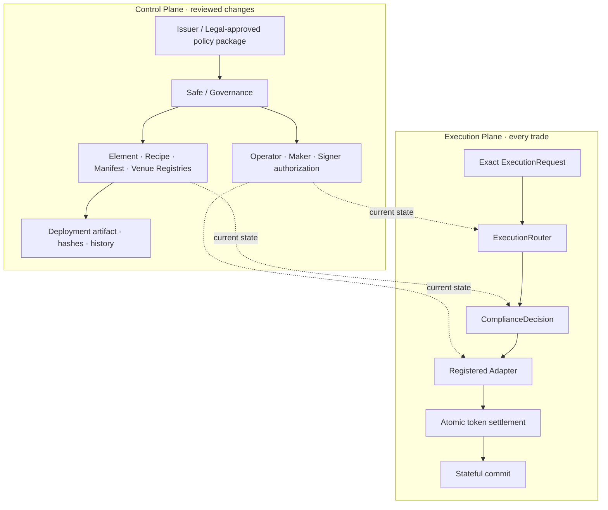

- **Control Plane**은 정책 등록, Manifest lifecycle, venue와 signer 권한을 다룬다.
- **Execution Plane**은 저장된 설정을 임의로 바꾸지 않고 매 거래에서 최신 상태를
  읽어 deterministic decision과 settlement를 수행한다.
- Production browser는 Control Plane의 검토 화면이 될 수 있지만 private key를
  보관하거나 mainnet transaction을 직접 broadcast하지 않는다.

### 3.4 Policy-to-Trade Lifecycle

```mermaid
flowchart LR
    Source["Legal / issuer requirement"]
    Map["Technical mapping<br/>facts + data sources"]
    Register["Element / Recipe registration"]
    Bind["Token Manifest binding"]
    Review["Governance review + activation"]
    Quote["Quote / trade request"]
    Evaluate["Latest evaluation"]
    Settle["Venue settlement"]
    Evidence["Commit + audit evidence"]

    Source --> Map --> Register --> Bind --> Review --> Quote --> Evaluate --> Settle --> Evidence
```

Corner Store는 `Source → Map`의 법률 판단을 자동화하지 않는다. SDK가 보장하는
부분은 검토된 mapping이 registry와 Manifest에 정확히 binding된 이후
`Quote → Evaluate → Settle → Evidence`가 같은 contract semantics를 따르는 것이다.

### 3.5 Implementation Map

| 아키텍처 책임 | 현재 구현 |
| --- | --- |
| 거래 진입점과 gate sequence | [`ExecutionRouter.sol`](../src/execution/ExecutionRouter.sol) |
| 양측 자산·RecipeBinding 평가 | [`ComplianceEngine.sol`](../src/compliance/ComplianceEngine.sol) |
| Manifest lifecycle와 bindings | [`TokenPolicyRegistry.sol`](../src/registry/TokenPolicyRegistry.sol) |
| Element / Recipe version registry | [`ElementRegistry.sol`](../src/registry/ElementRegistry.sol), [`RecipeRegistry.sol`](../src/registry/RecipeRegistry.sol) |
| venue 등록과 선택 | [`VenueRegistry.sol`](../src/execution/VenueRegistry.sol), [`VenueSelector.sol`](../src/execution/VenueSelector.sol) |
| RFQ full-fill settlement | [`RFQAdapter.sol`](../src/execution/adapters/rfq/RFQAdapter.sol) |
| Maker / signer 분리 | [`MakerAuthorizer.sol`](../src/registry/MakerAuthorizer.sol) |
| AMM reference integration | [`UniswapV3Adapter.sol`](../src/execution/adapters/amm/UniswapV3Adapter.sol) |
| governance pause state | [`OperatorRegistry.sol`](../src/registry/OperatorRegistry.sol) |
| provider-neutral compliance seam | [`services/compliance-data`](../services/compliance-data) |
| RFQ backend module contract | [`services/rfq`](../services/rfq) |
| deployment/config tooling | [`services/toolkit`](../services/toolkit), [`services/cli`](../services/cli) |

### 3.6 Core Data Contract

세 개의 데이터 구조가 policy와 execution 사이의 계약을 만든다. 아래 코드는
개념 축약본이며 정확한 ABI는 repository source가 기준이다.

```solidity
struct ComplianceContext {
    address initiator;
    address buyer;
    address seller;
    address tokenIn;
    address tokenOut;
    uint256 amountIn;
    uint256 amountOut;
    VenueType venueType;
    address venue;
    FlowType flowType;
    bool sellerIsAffiliate;
}

struct ComplianceDecision {
    bool allowed;
    bytes32 policyId;
    uint64 policyVersion;
    uint64 validUntil;
    uint256 maxAmount;
    address maxAmountToken;
    uint256 allowedVenueTypes;
    bytes32 reasonCode;
    uint256 flagsBitmap;
    bytes32 decisionHash;
}

struct ExecutionRequest {
    ComplianceContext context;
    uint256 amountOutMin;
    uint64 deadline;
    uint256 nonce;
    bytes venueData;
}
```

- `ComplianceContext`는 actor, pair, 방향, amount와 venue를 하나의 평가 입력으로
  고정한다.
- `ComplianceDecision`은 단순 boolean이 아니라 적용 policy, version, amount axis,
  allowed venue와 reason/flag를 함께 반환한다.
- `ExecutionRequest`는 compliance context와 slippage, deadline, replay nonce,
  venue-specific payload를 결합한다.

Router는 외부에서 전달된 decision을 실행 권한으로 신뢰하지 않는다. 매
`execute()`에서 current context를 Engine에 전달해 새 decision을 만들고,
request와 decision의 venue/amount 조건을 검증한 뒤 Adapter를 호출한다.

---

## 4. Composable Policy Model

Corner Store 정책은 네 개의 레이어로 구성된다.

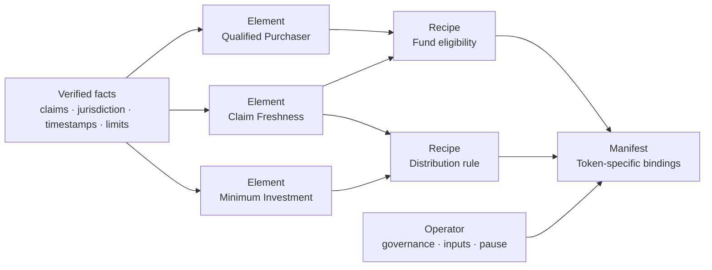

### 4.1 Element

Element는 하나의 재사용 가능한 사실 검사를 표현한다.

예:

- 투자자 claim의 존재와 유효기간
- 관할권 허용 여부
- Qualified Purchaser 또는 Accredited Investor 조건
- sanctions 결과
- 최소 투자 금액
- lockup과 acquisition timestamp
- 보유자 수 또는 누적 상태

Element는 법률 문서 전체를 저장하지 않는다. 필요한 입력을 받아 결정 가능한
결과와 안정적인 reason code를 반환한다.

### 4.2 Recipe

Recipe는 여러 Element를 조합해 하나의 정책 효과를 표현한다. 예를 들어
“유효한 QP claim과 최소 투자 금액을 모두 만족해야 한다”는 조건은 두 Element를
하나의 Recipe로 묶을 수 있다.

Recipe는 자산 이름에 종속되지 않는 재사용 가능한 규칙이어야 한다. 동일한
Recipe를 여러 토큰 Manifest가 서로 다른 version 또는 action으로 바인딩할 수
있다.

### 4.3 Manifest

Manifest는 특정 토큰에 적용되는 정책 profile이다.

- Manifest lifecycle과 version
- 적용할 `RecipeBinding[]`
- 지원하는 engine과 venue
- 자산별 facts와 issuer coverage
- 상세 off-chain 문서의 PII-free hash/reference

Manifest는 안정적인 core field와 확장 가능한 registry-backed binding을 함께
사용한다. 현재 registry는 regulated token마다 최대 8개의 binding을 허용해
평가 비용과 복잡도를 제한한다.

### 4.4 Operator

Operator는 자동화할 수 없는 판단과 protocol control을 담당한다.

- trusted issuer와 정책 input 승인
- Manifest propose/activate/suspend/retire
- Maker와 signer authorization
- emergency pause와 복구
- version change와 governance evidence
- off-chain monitoring 및 audit 연동

운영 권한은 production에서 단일 hot key가 아닌 Safe/multisig, 외부 signer,
timelock과 역할 분리를 사용해야 한다.

### 4.5 Illustrative Policy Profiles

현재 repository는 미국 규제 개념을 이용한 reference profiles로 architecture를
검증한다. 서로 다른 법률 개념을 하나의 “적격투자자” boolean으로 합치지 않는다.

| Profile / concept | 의미 | Reference implementation의 역할 |
| --- | --- | --- |
| Regulation D Rule 506(c) | offering의 purchaser가 Accredited Investor이고 issuer가 합리적인 검증 절차를 수행해야 하는 발행 맥락 ([SEC overview](https://www.sec.gov/resources-small-businesses/exempt-offerings/general-solicitation-rule-506c)) | `AccreditedInvestor`와 `RegD506cRecipe`를 통한 illustrative issuance gate |
| Investment Company Act §3(c)(7) | 해당 exception의 ownership이 원칙적으로 Qualified Purchaser로 구성되는 fund 맥락 ([§2(a)(51)](https://uscode.house.gov/view.xhtml?req=%28title%3A15+section%3A80a-2+edition%3Aprelim%29), [§3(c)(7)](https://uscode.house.gov/view.xhtml?req=%28title%3A15+section%3A80a-3+edition%3Aprelim%29)) | `QualifiedPurchaser`와 `Fund3c7Recipe`를 통한 illustrative fund gate |
| BUIDL-like | QP, claim freshness와 최소 투자액 등을 결합한 local demo profile | 실제 BlackRock BUIDL 또는 Securitize policy가 아닌 technical fixture |

**Accredited Investor와 Qualified Purchaser는 같은 자격이 아니다.** 각 정의,
threshold, entity/look-through 규칙과 적용 시점은 별도로 검토되어야 한다.
Corner Store의 Element는 승인된 결과를 표현할 수 있는 기술 seam이며, contract
이름만으로 실제 법률 검증이 완료되었다고 간주하지 않는다.

---

## 5. Recipe Binding Semantics

Manifest는 `RecipeBinding[]`으로 정책의 조합 의미를 명시한다.

```solidity
struct RecipeBinding {
    uint16 recipeId;
    uint16 recipeVersion;
    RecipeBindingMode mode;
    uint16 pathGroupId;
    uint8 priority;
}
```

| Mode | 의미 | 체결 영향 |
| --- | --- | --- |
| `REQUIRED_BLOCKING` | 반드시 통과해야 하는 정책 | 하나라도 실패하면 차단 |
| `PATH_OPTION` | 같은 group 안의 대체 경로 | group 내 OR, group 간 AND |
| `FLAG_ONLY` | 관찰·보고·surveillance 조건 | 실패해도 체결은 허용하고 flag 기록 |

예를 들어 토큰 A는 “정책 1 **또는** 정책 2”를 허용하고, 토큰 B는 “정책 1
**그리고** 정책 2”를 요구할 수 있다. 이 차이는 Recipe 코드를 복제하지 않고
Manifest binding으로 표현한다.

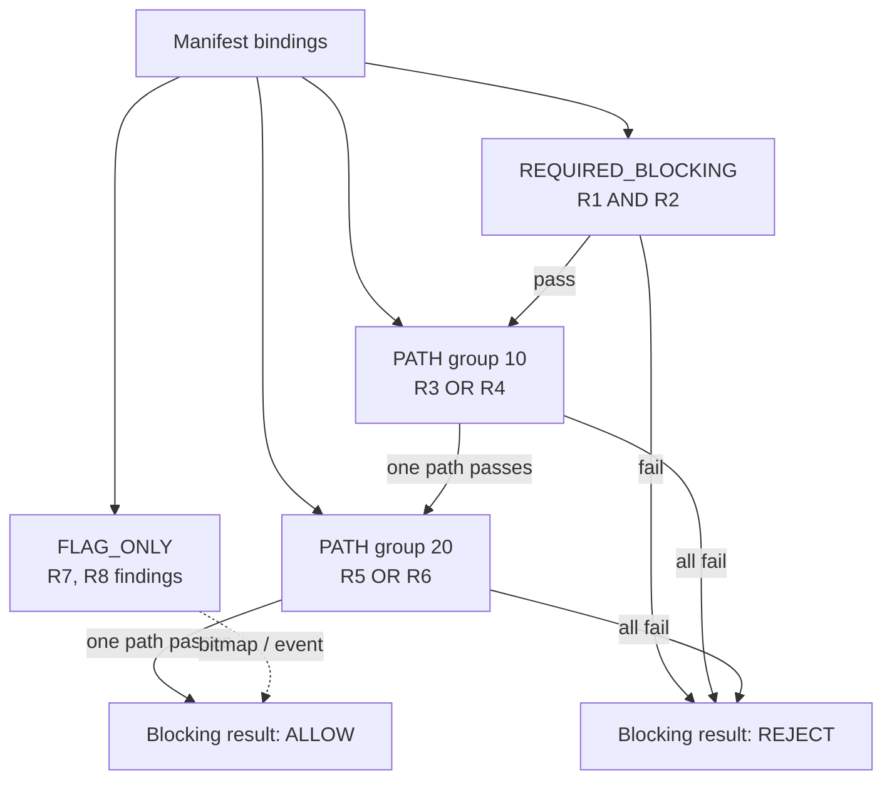

`FLAG_ONLY`는 blocking verdict와 분리된다. blocking 정책을 flag-only로
낮추는 override는 일반 onboarding 기능이 아니며 governance 제한이 필요하다.

### 5.1 Manifest Lifecycle

Manifest는 다음 lifecycle을 갖는다.

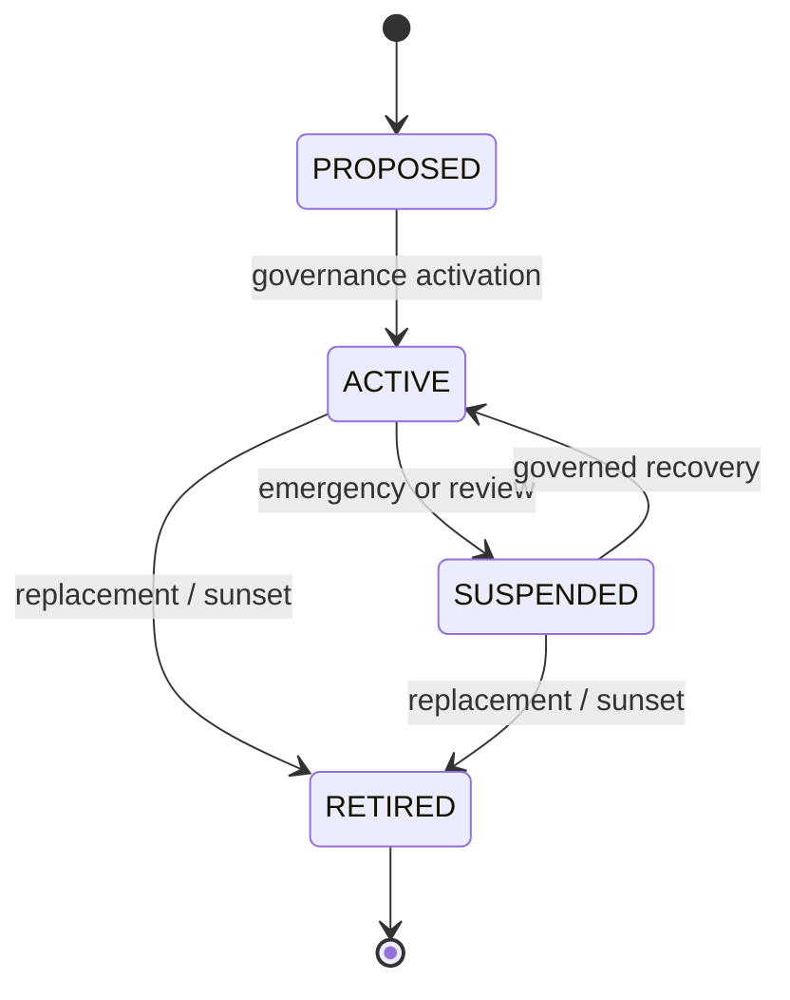

- 의미가 바뀌는 정책 업데이트는 version 증가와 검토 증거가 필요하다.
- emergency pause는 즉시 적용할 수 있어야 한다.
- 기존 version과 lifecycle event는 감사 가능하도록 보존한다.

---

## 6. Protected Execution Flow

모든 보호된 거래는 동일한 실행 순서를 따른다.

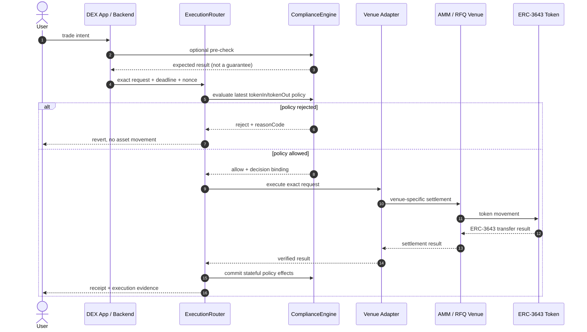

### 6.1 Finality of the Fill-Time Check

Pre-check는 사용자 경험을 개선하지만 권한을 예약하지 않는다. 다음 상태는 quote
발급과 fill 사이에 바뀔 수 있다.

- claim expiration 또는 revocation
- Maker/signer authorization
- Manifest status 또는 version
- pause 상태
- 투자 한도와 누적 상태

따라서 Router는 **체결 직전 최신 상태를 다시 평가**한다. 서명된 quote가 있어도
정책이 바뀌면 체결은 실패한다.

### 6.2 Check and Commit

보유자 수, acquisition state 또는 누적 한도처럼 거래 후 갱신되는 정책은
평가와 commit을 분리한다.

1. `evaluate()`가 현재 상태에서 거래 가능 여부를 판단한다.
2. Adapter가 실제 settlement를 수행한다.
3. settlement가 성공한 경우에만 `commit()`이 상태를 갱신한다.
4. settlement가 revert되면 정책 상태도 누적되지 않는다.

이 구조는 외부 venue 호출 전 state mutation과 실패한 거래의 phantom state를
방지한다.

### 6.3 Protocol Invariants

아래 항목은 UI나 backend 편의 기능이 아니라 보호된 실행 경로의 핵심 불변식이다.

| 불변식 | 의미 |
| --- | --- |
| Caller binding | `msg.sender`는 request initiator와 일치해야 한다. |
| Fresh evaluation | Router는 전달받은 과거 decision을 신뢰하지 않고 매 fill에서 평가한다. |
| Pair completeness | tokenIn과 tokenOut을 모두 분류하고 regulated Manifest를 누락하지 않는다. |
| Policy binding | decision은 context, policy ID/version, venue와 amount cap을 포함한다. |
| Registered dispatch | active registry의 Adapter와 venue만 실행한다. |
| Replay resistance | Router request nonce와 RFQ maker nonce를 각각 한 번만 사용한다. |
| Atomicity | 양쪽 token movement와 compliance commit은 모두 성공하거나 모두 revert한다. |
| Non-custody | Router와 reference Adapter에 의도하지 않은 잔액을 남기지 않는다. |
| Fail closed | UNKNOWN, inactive Manifest, invalid Recipe/version과 stale input은 거부한다. |
| Observable reason | 실패와 non-blocking finding은 안정적인 reason/flag로 설명 가능해야 한다. |

### 6.4 Worked Example: BUIDL-like RFQ Buy

이 예시는 실제 BUIDL 상품 연동이 아니라 current reference profile의 기술 흐름을
설명한다.

1. 투자자는 settlement asset으로 BUIDL-like token을 매수할 firm quote를 요청한다.
2. RFQ backend는 pricing·risk·nonce·signer module을 순서대로 호출한다.
3. Maker는 taker, pair, amounts, venue, nonce와 expiry가 고정된 quote에 서명한다.
4. 투자자는 quote를 포함한 exact `ExecutionRequest`를 Router에 제출한다.
5. Router는 global/asset/venue pause, caller, deadline과 request nonce를 확인한다.
6. ComplianceEngine은 양쪽 token classification과 ACTIVE Manifest를 읽고
   QP claim freshness, 최소 투자액 등 reference Recipe를 평가한다.
7. RFQAdapter는 현재 Maker 승인, signer authorization, quote expiry와 maker nonce를
   다시 확인한다.
8. 양쪽 `transferFrom`이 성공한 뒤에만 stateful policy commit과 execution evidence가
   확정된다.

Quote 이후 QP claim 또는 Maker authorization이 바뀌면 6번 또는 7번에서
거부되며 투자자와 Maker의 token balance는 이동하지 않는다.

---

## 7. Token Classification and Pair Evaluation

Corner Store는 거래 쌍의 양쪽 자산을 모두 분류한다.

| tokenIn / tokenOut 상태 | 처리 |
| --- | --- |
| 양쪽 모두 명시적 `UNREGULATED` | public pass-through 가능 |
| 한쪽이라도 `UNKNOWN` | fail closed |
| 한쪽 이상 regulated | 해당 자산의 ACTIVE Manifest를 누적 평가 |

`UNREGULATED` pass-through는 Corner Store 4-layer compliance 보장을 의미하지
않는다. 명시적으로 분류되지 않은 자산을 편의상 unregulated로 추정하지 않는다.

---

## 8. Execution Venue Model

### 8.1 AMM

AMM Adapter는 Router request를 pool call로 변환하고, 허용된 pool/fee tier,
token direction, amount와 settlement 결과를 검증한다. 현재 repository에는
Uniswap v3 reference adapter와 canonical integration proof가 포함된다.

LP onboarding, production pool governance, oracle/risk controls와 실제 운영
유동성은 통합 주체의 책임이며 추가 production work가 필요하다.

### 8.2 RFQ

RFQ는 규제 자산 MVP의 주된 reference path다. Maker가 특정 taker와 자산,
수량, 가격, nonce, 만료시간을 묶은 EIP-712 typed quote에 서명하고, taker가
Router를 통해 이를 fill한다. EIP-712는 structured data와 domain separation을
정의하지만 replay protection 자체는 제공하지 않으므로 nonce와 expiry를 protocol이
별도로 강제한다
([EIP-712](https://eips.ethereum.org/EIPS/eip-712)).

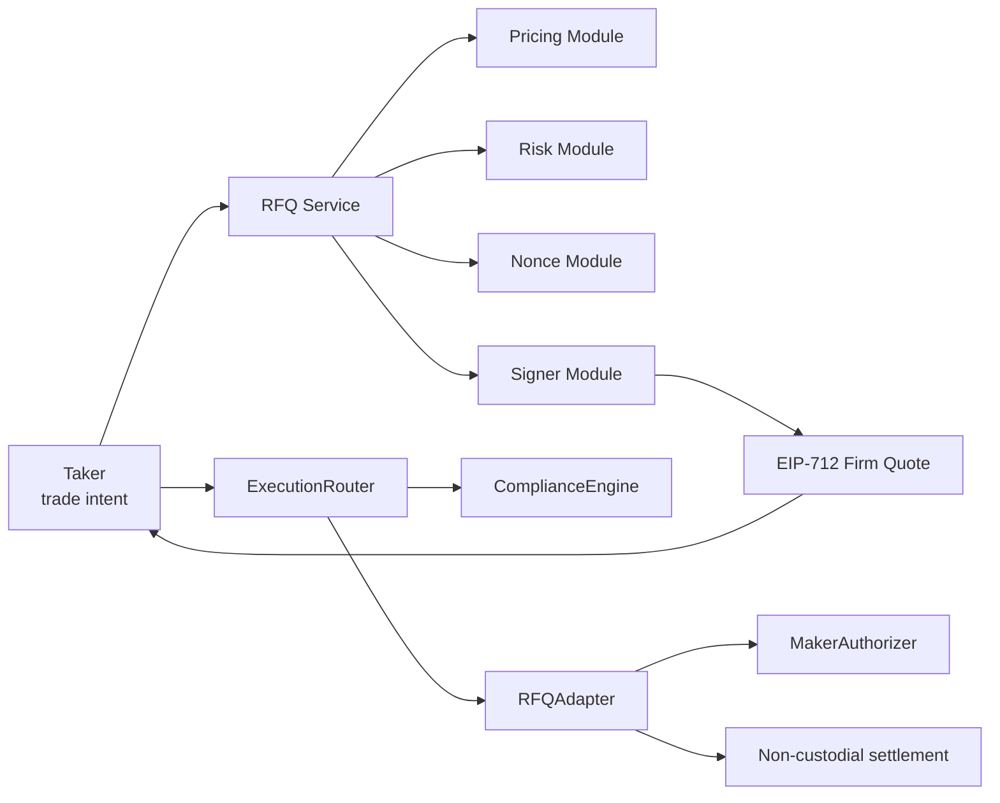

Quote는 최소한 다음 내용을 정확히 bind한다.

- chain ID와 verifying contract
- Maker와 taker
- tokenIn과 tokenOut
- amountIn과 amountOut
- venue
- maker-scoped nonce
- expiry

현재 RFQ v1은 **exact taker, exact full fill, protocol non-custodial** 모델이다.
Partial fill은 nonce, remaining amount와 cancellation semantics가 달라 별도
version으로 설계해야 한다.

Quote는 현재 Manifest version을 동결해 체결 권한을 예약하지 않는다. 정책
version이나 claim이 바뀌어도 quote payload는 남을 수 있지만, Router의 최신
evaluation이 이전 quote의 체결을 거부한다. 이는 “quote validity”와 “current
compliance eligibility”를 의도적으로 분리한 설계다.

### 8.3 Future Order Book

Order Book은 Adapter skeleton과 확장 지점만 존재한다. matching engine, custody,
partial fill, surveillance와 production settlement는 아직 구현 범위가 아니다.

---

## 9. Modular RFQ Backend

Corner Store는 특정 backend를 강제하지 않는다. RFQ SDK는 네 개의 capability
module을 교체할 수 있게 한다.

| Module | Capability | Production 책임 |
| --- | --- | --- |
| Pricing | `rfq.price.v1` | market data, NAV, spread, inventory-aware pricing |
| Risk | `rfq.risk.pre-sign.v1` | limits, reservations, counterparty and inventory risk |
| Signer | `rfq.sign.eip712.v1` | KMS/HSM/MPC custody, authorization, rotation |
| Nonce | `rfq.nonce.maker-scoped.v1` | durable atomic allocation and idempotency |

통합 방식은 세 가지다.

1. **library-only** — 기존 애플리케이션이 SDK 타입과 helper를 직접 사용한다.
2. **reference-service** — 최소 HTTP service를 생성하고 module을 교체한다.
3. **existing-backend** — 기존 backend의 pricing, risk, signer, nonce 인프라에
   Corner Store composition layer를 연결한다.

Local reference service의 fixed pricing, in-memory nonce와 mock signer는
production control이 아니다. production 운영자는 durable storage, endpoint
authentication, rate limiting, monitoring, secret custody와 WORM audit를
구현해야 한다.

---

## 10. On-chain and Off-chain Boundary

법률·신원 데이터 전체를 온체인에 저장하는 것은 비용과 개인정보 보호 측면에서
적절하지 않다. Corner Store는 hybrid model을 사용한다.

### On-chain

- 정책 ID, version과 binding
- 검증 가능한 compact facts
- trusted issuer와 operator authorization
- deterministic allow/reject 결과
- pause, lifecycle와 execution evidence
- PII-free hash 또는 reference

### Off-chain

- 원본 KYC/AML 자료와 개인정보
- 법률 해석과 승인 문서
- TA/provider payload
- pricing, risk와 inventory 계산
- 장기 감사 저장소와 analytics
- Router 밖 거래에 대한 surveillance

ERC-3643/ONCHAINID의 claim topic 번호 자체가 전 세계적으로 동일한 법률 의미를
보장하지는 않는다. 발행사 또는 운영자는 토큰별 claim schema와 trusted issuer
정책을 검토해 Corner Store Manifest와 명시적으로 bind해야 한다.

### 10.1 Why Hybrid Rather Than Fully On-chain?

| 선택 | 장점 | 비용·위험 | Corner Store 선택 |
| --- | --- | --- | --- |
| 모든 자료 온체인 | 직접 검증, 높은 가용성 | PII 노출, 높은 비용, 법률 문서 갱신 어려움 | 사용하지 않음 |
| 모든 판단 오프체인 | 유연성, 개인정보 보호 | backend 우회와 불투명한 집행 | 최종 gate로 사용하지 않음 |
| compact on-chain + approved off-chain source | 결정적 집행과 현실적 데이터 운영의 균형 | provider freshness·governance 필요 | 기본 모델 |

오프체인 provider 결과가 있다고 해서 자동으로 신뢰하지 않는다. source identity,
freshness, status와 PII-free hash를 검증 가능한 입력으로 제한하고 stale/missing
상태는 fail closed해야 한다.

---

## 11. Security Model

### 11.1 Protected Boundary

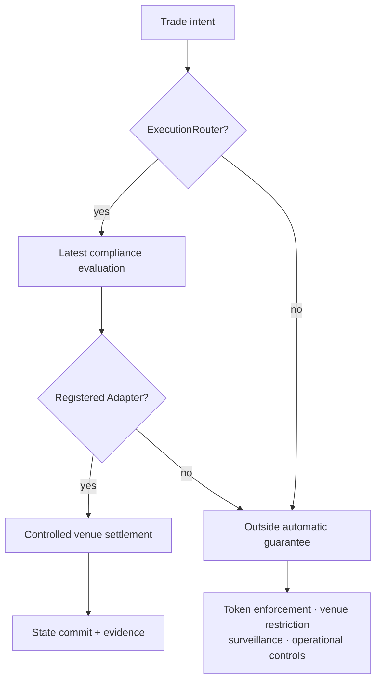

다음 경로는 Corner Store Router의 자동 보장 밖에 있다.

- 사용자의 직접 ERC-3643 token transfer
- 직접 AMM pool 또는 RFQ venue 호출
- 등록되지 않은 Adapter
- wrapper, vault 또는 bridge 내부 이동
- custodian 또는 off-chain ledger의 이전

이 경로는 issuer token-level enforcement, venue access control, wrapper-specific
integration 또는 surveillance를 통해 다뤄야 한다. Corner Store가 전 세계의
모든 자산 이동을 막는다고 주장해서는 안 된다.

### 11.2 주요 위협과 통제

| 위협 | 주요 통제 | 남은 production 책임 |
| --- | --- | --- |
| Router 우회 | Adapter의 Router-only restriction, venue classification | 외부 venue와 token transfer 감시 |
| 오래된 quote | fill-time compliance 재검사, expiry | clock/chain monitoring |
| Quote replay | maker-scoped nonce와 used/cancel state | durable multi-instance allocator |
| Maker key와 signer 혼동 | MakerAuthorizer로 settlement account와 signer 분리 | HSM/MPC, rotation runbook |
| 잘못된 Manifest | validation, bounded bindings, lifecycle | legal/issuer approval, Safe/timelock |
| 실패 후 상태 오염 | settlement 성공 후 commit | hostile integration tests |
| 개인정보 노출 | PII를 온체인에 저장하지 않음 | provider data governance |
| Emergency key compromise | pause와 role separation | multisig, incident response |

### 11.3 Governance

정책 변경과 실행 권한은 변화의 위험도에 따라 다르게 처리한다.

- 즉시 강화 또는 emergency pause: 신속한 containment
- 정책 완화 또는 semantic change: timelock과 multisig review
- signer rotation: 기존 권한 revoke와 신규 권한 activation의 증거
- Manifest 교체: version 증가, lifecycle event, 이전 기록 보존

### 11.4 Assumptions and Residual Risk

Corner Store의 contract가 올바르게 동작해도 다음 외부 가정이 깨지면 전체 시스템의
규제 적합성은 보장되지 않는다.

- issuer/TA가 잘못된 identity 또는 claim을 발급한다.
- legal-approved mapping 자체가 잘못되었거나 낡았다.
- governance가 악성 Adapter, venue 또는 정책 완화를 승인한다.
- Maker inventory와 allowance가 quote 이후 변경된다.
- wrapper/custodian/off-chain ledger에서 경제적 소유권이 별도로 이전된다.
- indexer, monitoring 또는 incident response가 production 요구수준을 충족하지 못한다.

따라서 “smart contract가 허용했다”는 사실은 “법률적으로 완전하다”는 의미가
아니다. Corner Store는 승인된 정책을 일관되게 집행하는 기술 시스템이며,
사실·법률·운영 입력의 품질을 대신 보증하지 않는다.

---

## 12. Developer and Operator Experience

Corner Store의 제품은 개별 DEX 화면이 아니라, 통합자가 자신의 시장을 만들고
배포·운영할 수 있게 하는 SDK와 scaffold다.

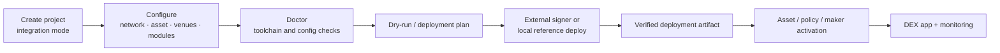

### 12.1 Toolkit and CLI

Toolkit과 CLI는 다음 작업을 지원한다.

- integration project 생성
- config/integration/scenario 파일 검증
- RFQ module capability conformance
- toolchain doctor
- read-only deployment plan과 local reference deployment
- deployment artifact verification

### 12.2 Deployment Studio

Deployment Studio는 local control plane으로 CLI의 실제 입력과 상태를
시각화한다.

- project mode와 network 설정
- asset profile과 venue 선택
- RFQ module 구성
- doctor, dry-run, local reference deployment
- artifact viewer와 verify
- 동일 artifact를 사용하는 reference DEX demo handoff

Production mainnet broadcast는 브라우저 버튼으로 직접 실행하지 않는다.
외부 signer, Safe/multisig, reviewed commit, RPC allowlist와 staged activation을
사용하는 별도 runbook을 따른다.

### 12.3 Operator Surfaces

현재 Operator API와 dashboard는 reference/demo 운영 가시성을 제공한다.

- Manifest와 venue 상태
- Maker authorization
- RFQ lifecycle과 fill/rejection evidence
- investor claim fixture와 enforcement scenarios
- deployment artifact lineage

Production operations에는 인증, durable indexer, WORM audit, alerting,
incident workflow와 provider integration이 추가로 필요하다.

### 12.4 How Different Integrators Use the Product

#### Existing DEX

1. Solidity interface와 Router를 배포하거나 기존 stack에 연결한다.
2. 자체 venue를 공통 Adapter interface로 감싼다.
3. legal/issuer-approved Manifest를 등록한다.
4. 기존 frontend/backend는 exact `ExecutionRequest`만 생성한다.
5. Foundry integration suite로 허용·거부·직접호출·원자성을 검증한다.

#### RFQ Operator with an Existing Backend

1. `existing-backend` mode로 RFQ composition helper를 가져온다.
2. 기존 pricing, risk, signer와 durable nonce module을 capability contract에 맞춘다.
3. module conformance를 실행한다.
4. 생성한 quote를 RFQAdapter domain과 exact fields에 맞춰 서명한다.
5. fill은 반드시 Router로 제출하고 backend pre-check를 최종 판단으로 사용하지 않는다.

#### New Reference Integration

1. CLI로 `library-only` 또는 `reference-service` project를 생성한다.
2. versioned config를 작성하고 `doctor`와 dry-run을 수행한다.
3. local reference stack과 artifact를 검증한다.
4. fixed/mock module을 실제 provider와 운영 control로 교체한다.
5. production에서는 external signer와 Safe proposal을 통해 단계적으로 활성화한다.

Conformance 통과는 interface compatibility를 증명할 뿐 가격 모델, 법률 정책,
signer custody 또는 production 운영의 적합성을 인증하지 않는다.

---

## 13. Reference Demonstration

현재 BUIDL-like와 Reg D profile은 실제 BlackRock BUIDL 또는 Securitize
production integration이 아니다. Mock TA와 ERC-3643-compatible fixture를
사용해 다음 아키텍처 주장을 재현한다.

1. 적격 투자자는 RFQ quote를 요청하고 Router를 통해 체결할 수 있다.
2. 비적격 투자자는 정책 reason과 함께 차단된다.
3. Quote 발급 후 claim이 만료되면 동일한 signed quote도 fill 시점에 거부된다.
4. Quote 발급 후 Maker 승인을 취소하면 fill이 거부된다.
5. Adapter를 직접 호출해 Router를 우회하려는 시도는 실패한다.
6. 성공한 거래만 잔액, event와 체결 history에 반영된다.

이 demo의 목적은 특정 상품의 법적 적합성을 증명하는 것이 아니라,
**정책 상태가 체결 직전까지 바뀔 수 있어도 실행 경로가 최신 결과를 강제한다**는
기술적 구조를 검증하는 것이다.

---

## 14. Current Implementation Status

아래는 2026년 7월 repository 기준이다.

| 영역 | 현재 상태 |
| --- | --- |
| Compliance Core | bounded `RecipeBinding[]`, 양측 자산 평가, check/commit 구현 |
| Policy library | identity, claim, jurisdiction, QP/AI, sanctions, lockup, limits 등 reference Elements/Recipes |
| Execution Router | deadline/nonce/request binding, venue dispatch, latest compliance |
| AMM | Uniswap v3 reference adapter와 canonical integration proof |
| RFQ | EIP-712 exact full-fill, MakerAuthorizer, local backend와 SDK |
| Order Book | Adapter skeleton만 존재 |
| Asset profiles | BUIDL-like, Reg D reference fixtures |
| Integration tooling | Toolkit, CLI, generated project modes, optional Docker |
| Deployment | local reference deployment와 production core planning/runbook |
| Operations | read-only Operator API와 reference dashboard |
| Verification | Foundry tests, service smoke tests, Anvil end-to-end scenarios |

마지막 기록된 전체 검증은 Foundry 669 tests와 service/tooling checks를
포함한다. 이 수치는 구현 진행에 따라 바뀔 수 있으므로 최신 상태는
[`PROGRESS.md`](../PROGRESS.md)와 CI 결과를 우선한다.

### 14.1 Claim-to-Evidence Matrix

| 백서의 기술 주장 | 구현 근거 | 검증 형태 |
| --- | --- | --- |
| 최신 policy를 fill마다 평가 | `ExecutionRouter.execute()` → `ComplianceEngine.evaluate()` | unit/integration, claim-expiry E2E |
| Adapter 직접 호출 차단 | 각 Adapter의 Router-only gate | unauthorized caller tests |
| required/path/flag 조합 | bounded binding evaluator | binding/lifecycle tests |
| 양쪽 regulated 자산 누적 평가 | tokenIn/tokenOut classification | mixed/regulated pair tests |
| Quote replay/cancel/expiry 통제 | Router nonce + maker quote nonce | RFQ replay/cancel/expiry tests |
| Maker와 signer 분리 | `MakerAuthorizer` | delegate/revoke/ERC-1271 tests |
| 실패 시 자산 이동 방지 | atomic transaction + `SafeERC20` | balance invariant tests |
| AMM callback origin 검증 | canonical pool validation | callback spoof tests |
| SDK 교체 가능성 | module capability + conformance | service smoke/conformance tests |
| 배포 artifact lineage | Toolkit/CLI verify/checkpoint | CLI and deployment smoke |

OpenZeppelin
[`SafeERC20`](https://docs.openzeppelin.com/contracts/4.x/api/token/erc20#SafeERC20)은
false 또는 no-return ERC-20 동작을 안전하게 감싸는 reference utility이며
RFQAdapter의 양쪽 자산 이동에 사용된다.

### 14.2 What the Evidence Does Not Prove

- 특정 법률 profile의 실제 관할권 적합성
- 실제 issuer/TA data의 정확성
- production RFQ pricing의 공정성 또는 best execution
- production key custody와 운영 복구 수준
- 독립적인 security audit 완료
- Router 밖 모든 경제적 소유권 이전의 통제

---

## 15. Production Readiness and Roadmap

Corner Store는 현재 SDK/reference implementation 단계다. Production 채택 전
다음 작업이 필요하다.

### Compliance and Identity

- 실제 issuer/TA의 claim schema와 trusted issuer mapping
- 법률 검토를 통과한 Element input과 Recipe profile
- Securitize 또는 다른 TA provider adapter
- acquisition lot, holder counting과 rejection audit의 production data layer

### RFQ Operations

- database-backed atomic nonce와 idempotency
- production pricing, inventory reservation과 risk engine
- external signer, KMS/HSM/MPC와 signer rotation
- authenticated endpoint, rate limiting, monitoring과 WORM audit
- partial fill이 필요할 경우 새로운 RFQ protocol version

### Venue and Market Infrastructure

- production AMM pool/LP onboarding과 governance
- Order Book matching/custody/surveillance
- wrapper, bridge와 external DEX integration policy
- Router 밖 거래 감시와 incident response

### Deployment and Assurance

- production RPC/network configuration
- Safe/multisig proposal과 staged activation
- secret management와 operational access control
- 독립적인 smart contract security review
- 관할권별 법률 검토와 운영 승인

### Known Open Architecture Decisions

- canonical human-readable recipe key와 numeric ID alias
- per-element enforcement override compiler
- token 단위와 token×venue 단위 Manifest scope
- production TA/provider와 amount-specific acquisition lot allocation
- production indexer의 reorg, retention과 WORM provider
- Adapter upgrade/replace governance와 production upgradeability
- Order Book의 matching, custody, partial fill과 surveillance model

---

## 16. Design Principles

1. **Fail closed** — 알 수 없는 자산, 잘못된 binding, 비활성 Manifest는 허용으로
   추정하지 않는다.
2. **Latest state wins** — quote나 pre-check가 아니라 fill-time 상태가 최종이다.
3. **Policy is composable** — 토큰마다 Solidity를 복제하지 않고
   Element/Recipe/Manifest를 조합한다.
4. **Execution is pluggable** — 정책 코어를 바꾸지 않고 Adapter를 추가한다.
5. **Trust boundaries are explicit** — ERC-3643, ONCHAINID, TA와 operator를
   외부 권위로 다룬다.
6. **State changes are atomic** — 성공한 settlement만 compliance state에
   commit한다.
7. **PII stays off-chain** — 온체인에는 결정에 필요한 compact fact와 증거만 둔다.
8. **Demo is not production** — mock fixture와 production control을 문서와 UI에서
   명확히 구분한다.

### 16.1 Architectural Trade-offs

| 결정 | 선택 이유 | 감수하는 비용 |
| --- | --- | --- |
| 중앙 ExecutionRouter | 모든 supported venue에 같은 final gate 적용 | Router availability와 governance가 중요해짐 |
| Registry-based composition | 새 자산·정책을 Router 수정 없이 추가 | 잘못된 registry 변경 위험, validation 필요 |
| 최대 8 bindings / Recipe당 32 Elements | gas와 실행 복잡도에 상한 설정 | 매우 큰 정책은 분해·새 version 필요 |
| latest-state fill check | quote 이후 정책 변경도 즉시 반영 | quote가 서명돼도 체결 실패 가능 |
| exact full-fill RFQ v1 | replay·accounting·원자성을 단순화 | partial execution과 일부 유동성 활용 제한 |
| non-custodial settlement | protocol custody risk와 중간 잔액 최소화 | Maker balance/allowance 변동에 fill 실패 가능 |
| hybrid data model | 개인정보·비용과 deterministic enforcement 균형 | provider freshness와 audit infrastructure 필요 |
| explicit `UNKNOWN` fail-closed | onboarding 누락을 허용으로 오해하지 않음 | 자산 등록 전 composability 제한 |

### 16.2 Token and Economic Model

현재 Corner Store architecture는 protocol token, token sale, staking 또는
governance-token economics를 정의하지 않는다. Fee model과 상용 licensing도
현재 기술 protocol의 불변식이 아니다. 향후 경제 모델이 추가되더라도
ComplianceEngine의 판단, issuer/TA trust boundary와 Router execution safety를
완화해서는 안 된다.

---

## 17. Conclusion

Corner Store는 또 하나의 KYC provider나 단일 DEX를 만들기보다, 규제 자산의
시장 접근 정책과 거래 실행 경로 사이에 재사용 가능한 계약을 만든다.

Element, Recipe, Manifest는 법률·운영 요구사항을 조합 가능한 정책으로 표현하고,
ExecutionRouter와 Adapter는 AMM 또는 RFQ의 체결 직전 그 정책을 강제한다.
TypeScript SDK, CLI와 reference services는 통합자가 자신의 backend, signer,
pricing과 governance를 유지하면서 동일한 온체인 실행 모델을 사용할 수 있게
한다.

현재 구현은 이 구조를 local reference environment에서 검증한다. Production
채택의 다음 단계는 실제 issuer/TA schema, 법률 승인 정책, durable RFQ
infrastructure, multisig deployment와 독립 보안 검토를 결합하는 것이다.

---

## 18. Glossary

| 용어 | 의미 |
| --- | --- |
| ERC-3643 | identity와 compliance를 포함하는 permissioned token 표준 |
| ONCHAINID | claim을 연결하는 identity trust layer |
| Element | 하나의 재사용 가능한 정책 fact check |
| Recipe | 여러 Element를 조합한 정책 효과 |
| Manifest | 특정 토큰의 Recipe binding, version과 lifecycle |
| Operator | 정책 입력, 권한, pause와 governance를 관리하는 주체 |
| Router | 최신 compliance를 평가하고 Adapter를 호출하는 실행 진입점 |
| Adapter | 특정 AMM/RFQ/Order Book venue와 Router를 연결하는 모듈 |
| RFQ | Maker가 특정 조건으로 서명한 견적을 taker가 수락하는 거래 방식 |
| TA | Transfer Agent. 신원·자격·이전 기록의 외부 권위 주체 |
| Pre-check | 거래 전 예상 결과. 최종 체결 보장은 아님 |
| Commit | settlement 성공 후 상태형 정책을 갱신하는 단계 |

---

## 19. Sources and References

이 백서는 아래 current source-of-truth 문서를 요약한다. 충돌이 발생하면 더
구체적인 architecture/spec/ADR 문서를 우선한다.

### 19.1 Repository Sources

- [Product scope](./MVP-v2-multi-venue.md)
- [Architecture index](./architecture/README.md)
- [Token and identity boundary](./architecture/token-and-identity.md)
- [Asset Manifest](./architecture/asset-manifest.md)
- [Compliance policy](./architecture/compliance-policy.md)
- [Execution routing](./architecture/execution-routing.md)
- [Venue architecture](./architecture/venues/README.md)
- [Security rules](./security.md)
- [RFQ threat model](./rfq-threat-model.md)
- [Production RFQ policy](./product-specs/production-rfq-policy.md)
- [Production deployment](./deployment-production.md)
- [Architecture decisions](./decisions/decision-register.md)
- [Roadmap](./ROADMAP.md)
- [Current implementation progress](../PROGRESS.md)

### 19.2 External Primary References

1. [ERC-3643: T-REX — Token for Regulated Exchanges](https://eips.ethereum.org/EIPS/eip-3643)
2. [ERC-3643 Built-in Compliance Framework](https://docs.erc3643.org/erc-3643/overview-of-the-protocol/built-in-compliance-framework)
3. [EIP-712: Typed Structured Data Hashing and Signing](https://eips.ethereum.org/EIPS/eip-712)
4. [SEC — General Solicitation under Rule 506(c)](https://www.sec.gov/resources-small-businesses/exempt-offerings/general-solicitation-rule-506c)
5. [15 U.S.C. § 80a-2(a)(51) — Qualified Purchaser Definition](https://uscode.house.gov/view.xhtml?req=%28title%3A15+section%3A80a-2+edition%3Aprelim%29)
6. [15 U.S.C. § 80a-3(c)(7)](https://uscode.house.gov/view.xhtml?req=%28title%3A15+section%3A80a-3+edition%3Aprelim%29)
7. [OpenZeppelin Contracts 4.x — SafeERC20](https://docs.openzeppelin.com/contracts/4.x/api/token/erc20#SafeERC20)

Rule 506(c), Accredited Investor, Qualified Purchaser와 §3(c)(7) references는
reference profiles의 배경을 설명하기 위한 1차 자료다. 실제 거래 또는 상품에
대한 적용은 별도의 법률 검토가 필요하다.

### 19.3 Revision History

| Version | Date | Change |
| --- | --- | --- |
| 0.1 | 2026-07 | 최초 architecture/implementation draft |
| 0.2 | 2026-07 | 목적·독자·요구사항·control/data plane·불변식·통합 예시·trade-off·evidence·외부 참고문헌 보강 |
