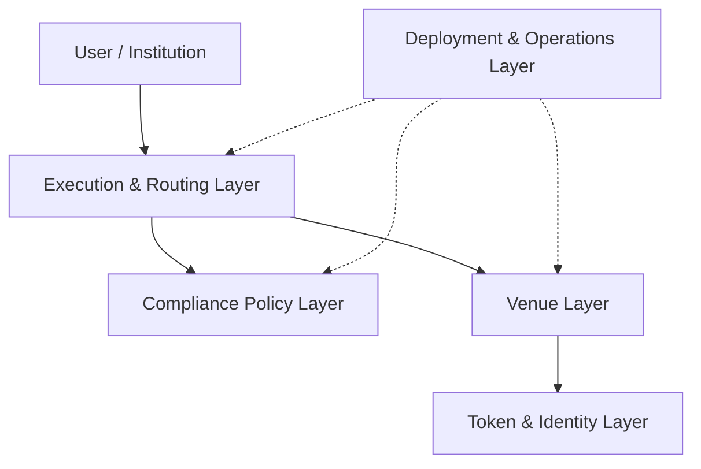

# Corner Store Architecture

Corner Store 아키텍처는 구현 언어나 파일 위치보다 책임과 trust boundary를 기준으로
나눈다.

## Layer Index

| 레이어                  | 핵심 질문                                      | 문서                                                     |
| ----------------------- | ---------------------------------------------- | -------------------------------------------------------- |
| Token & Identity        | 주소가 토큰을 보유하고 전송받을 자격이 있는가? | [`token-and-identity.md`](./token-and-identity.md)       |
| Compliance Policy       | 이 거래가 어떤 조건과 venue에서 허용되는가?    | [`compliance-policy.md`](./compliance-policy.md)         |
| Execution & Routing     | 허용된 결정을 어느 adapter로 전달할 것인가?    | [`execution-routing.md`](./execution-routing.md)         |
| Venue                   | AMM, RFQ, Order Book이 어떻게 검증·결제되는가? | [`venues/README.md`](./venues/README.md)                 |
| Deployment & Operations | 어떻게 반복 배포하고 권한과 상태를 추적하는가? | [`deployment-operations.md`](./deployment-operations.md) |

## Cross-Layer Rules

- ERC-3643 transfer 검사는 Corner Store의 execution-level 검사를 대체하지 않는다.
- `ComplianceEngine`은 거래를 실행하지 않고, Adapter는 법률 정책을 정의하지 않는다.
- `ExecutionRouter`는 허용된 decision과 venue를 검증하지만 matching을 수행하지 않는다.
- 규제 상태가 `UNKNOWN`, `SUSPENDED`, delisted인 경우 신규 실행은 기본 거부한다.
- 실제 settlement 직전의 compliance 검증이 필요한 venue는 주문·견적 생성 시점
  검사만으로 대체하지 않는다.
- non-custodial Router와 Adapter에는 의도하지 않은 자산 잔액이 남지 않아야 한다.
- 배포와 권한 이전은 검증 가능한 manifest와 연결되어야 한다.

## Decision Records

현재는 책임 레이어 문서 안의 `Current Decisions`와 `Open Decisions`로 결정을
관리한다. 다음 조건에 해당할 때만 별도 ADR을 만든다.

- 여러 레이어의 책임을 변경한다.
- 대안 간 trade-off가 크고 되돌리기 어렵다.
- 보안, custody, governance 또는 규제 경계를 변경한다.
- 기존 결정을 대체하며 별도 이력 보존이 필요하다.

ADR 번호를 먼저 만드는 것보다 결정의 범위와 영향이 충분히 커졌을 때 분리한다.
