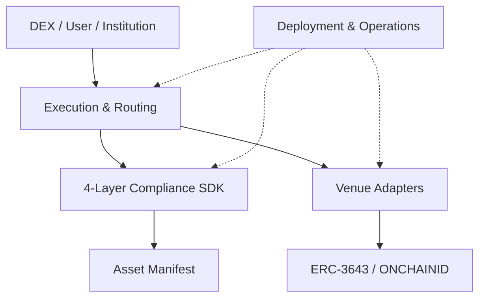

# Corner Store Architecture

Corner Store는 **재사용 가능한 DEX-level compliance SDK**와 이를 검증하는
**reference multi-venue execution system**이다. 책임은 법률 모델과 실행 인프라를
섞지 않도록 나눈다.

## Responsibility Index

| 경계 | 핵심 질문 | 문서 |
| --- | --- | --- |
| Token & Identity | 주소가 토큰을 보유·수신할 자격이 있는가? | [`token-and-identity.md`](./token-and-identity.md) |
| Compliance Stack | 어떤 사실과 규제가 이 거래에 적용되는가? | [`compliance-policy.md`](./compliance-policy.md) |
| Asset Manifest | 이 자산에 어떤 Recipe·engine·coverage가 binding되는가? | [`asset-manifest.md`](./asset-manifest.md) |
| Execution & Routing | 평가 결과를 어느 adapter로 전달할 것인가? | [`execution-routing.md`](./execution-routing.md) |
| Venue | AMM, RFQ, Order Book이 어떻게 검증·결제되는가? | [`venues/README.md`](./venues/README.md) |
| Deployment & Operations | 어떻게 반복 배포하고 권한·상태를 추적하는가? | [`deployment-operations.md`](./deployment-operations.md) |

## Named 4-Layer Compliance Model

4-Layer는 번호 대신 이름으로 참조한다.

| Layer | 법률적 대응 | 기술 책임 |
| --- | --- | --- |
| Element | 구성요건 사실 | 원자적·재사용 가능한 검증 |
| Recipe | 하나의 법률효과 | Element 조합과 활성화 조건 |
| Manifest | 특정 자산에 적용되는 규제 | Recipe, engine, version과 coverage binding |
| Operator | 판단·승인·감시 주체 | 권한 통제된 상태 입력과 운영 |

ERC-3643 Token & Identity는 이 네 layer 중 하나가 아니라 그 아래에서 재사용하는
외부 발행 측 trust boundary다.

## Cross-Boundary Rules

- 활성화된 여러 Recipe는 cumulative AND로 평가한다.
- 같은 context의 중복 Element는 한 번만 평가할 수 있지만 결과 의미를 바꾸지 않는다.
- 발행 측에서 검증한 사실은 Manifest coverage로 표현하고 불필요한 재검증을 줄인다.
- `ComplianceEngine`은 거래를 실행하지 않고 Adapter는 정책을 정의하지 않는다.
- `ExecutionRouter`는 matching이나 법률 해석을 수행하지 않는다.
- public path는 명시적 `UNREGULATED` 자산에만 허용하며 4-Layer 보장을 주장하지
  않는다.
- Manifest와 `UNREGULATED` 분류가 모두 없는 자산은 `UNKNOWN`으로 fail-closed한다.
- `ACTIVE` Manifest의 누락·불완전 reference는 fail-closed다.
- settlement 직전 최신 Manifest, actor와 operator 상태를 평가한다.
- Corner Store의 4-Layer compliance 보장은 `ExecutionRouter`를 통한
  router-mediated trade에 한정한다.
- ERC-3643 직접 전송, 직접 pool/venue 호출, wrapper/vault/custodian 이전과
  offchain beneficial ownership 이전은 별도 제한·위임·out-of-scope 결정 없이는
  Corner Store 보장으로 표현하지 않는다.
- non-custodial Router와 Adapter에는 의도하지 않은 자산 잔액이 남지 않는다.
- 무거운 자료와 재량 판단은 오프체인에 두고 승인된 결과만 온체인에 입력한다.

## Product Boundary

현재 저장소가 구현할 범위:

- Compliance Core SDK: 공통 context, Element/Recipe/Manifest registry와 evaluation
- Execution Integration Kit: generic `ExecutionRouter`, `VenueRegistry`, structured
  decision과 공통 Adapter interface
- 양쪽 자산 Manifest를 결합하는 cumulative multi-Recipe orchestration
- Corner Store reference DEX: Uniswap v3 reference adapter, RFQ/Order Book 예제
  Adapter와 testnet 배포 구성
- mock ERC-3643 기반 testnet proof

SDK 공통 컴포넌트는 특정 venue나 Corner Store 배포 구성에 의존하지 않는다.
구체 Adapter는 reference 구현이며, 제3의 DEX는 같은 interface를 구현해 자체
venue를 등록할 수 있다.

현재 skeleton의 보안 보장은 limited-scope model이다. Router를 거치지 않는 RWA
이동 또는 경제적 노출 이전은 발행자 token-level enforcement, controlled
venue/settlement 또는 명시적 out-of-scope 선언으로 별도 처리해야 한다.

외부 협업 범위:

- production 법률 기준과 Element 승인
- production operator, licensing, governance와 monitoring
- identity/KYC provider와 발행자 onboarding
- 실제 Manifest 선언·검증의 계약상 책임

## Decision Records

각 책임 문서의 `Current Decisions`와 `Open Decisions`를 우선한다. 여러 경계를
바꾸거나 되돌리기 어려운 결정은 루트 `DECISIONS.md`에 기록한다.
