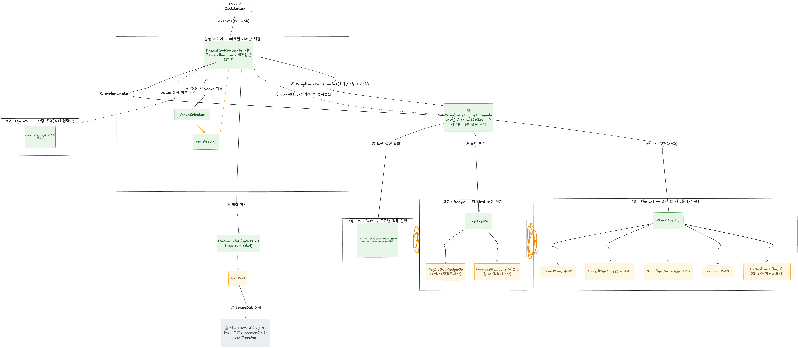

# Corner Store 스켈레톤 — 코드 이해 가이드

> 이 문서는 `feat/skeleton-architecture`에서 구현된 Solidity 골격을 **어떻게 읽고
> 이해하면 되는지** 안내한다. 설계 근거는
> [`../superpowers/specs/2026-06-13-skeleton-architecture-design.md`](../superpowers/specs/2026-06-13-skeleton-architecture-design.md),
> 구현 순서는 [`../superpowers/plans/2026-06-13-skeleton-architecture.md`](../superpowers/plans/2026-06-13-skeleton-architecture.md)를 본다.

## 0. 한 문장 요약

증권형 토큰(ERC-3643)을 거래할 때, **거래 직전에 "이 거래가 적법한가"를 코드가
자동 판정**하고 허용된 거래만 venue(AMM 등)로 보내는 시스템의 **골격**이다.
배선(라우팅 → 컴플라이언스 평가 → venue 실행 → ERC-3643 transfer)은 **실제로
동작**하고, 법률 판정 로직만 mock이다. 실제 ERC-3643(T-REX)을 테스트에서 진짜로
배포해 `isVerified`/`canTransfer`까지 흐른다.

## 1. 큰 그림 — 5개 레이어

```
사용자/기관
   │  ExecutionRequest
   ▼
[실행/라우팅]  ExecutionRouter ──평가요청──▶ [컴플라이언스]  ComplianceEngine
   │                                              │  Manifest/Recipe/Element 조회
   │  허용된 decision만                            ▼
   │                                         (Registry 4종)
   ▼
[venue 선택]  VenueSelector → VenueRegistry
   │
   ▼
[venue 실행]  UniswapV3Adapter → (MockPool) ──▶ [토큰/신원]  실제 ERC-3643 Token
                                                    isVerified · canTransfer
```

| 레이어 | 핵심 질문 | 주요 컨트랙트 |
| --- | --- | --- |
| 실행/라우팅 | 허용된 결정을 어느 adapter로 보낼까 | `ExecutionRouter` |
| 컴플라이언스 | 이 거래가 어떤 조건에서 허용되나 | `ComplianceEngine`, Element/Recipe |
| 레지스트리 | 무엇이 등록되어 있나 | `ElementRegistry`, `RecipeRegistry`, `TokenPolicyRegistry`, `OperatorRegistry` |
| venue | AMM/RFQ/OB가 어떻게 검증·결제하나 | `VenueRegistry`, `VenueSelector`, `*Adapter` |
| 토큰/신원 | 이 주소가 토큰을 받을 자격이 있나 | 외부 ERC-3643(T-REX) — 우리가 만들지 않고 연동 |

### 전체 구조 다이어그램

한 거래의 흐름(①~⑨)과 4개 레이어, 그리고 실제/mock 구분을 한 장에 담았다.



**색 범례**
- 🟢 초록 = **실제 동작하는 배선/구조** (라우팅·엔진·레지스트리·어댑터 콜백)
- 🟡 노랑 = **mock** (판정 로직은 설정값 / MockPool 1:1) — 인터페이스는 확정, 내용만 채우면 됨
- ⚪ 회색 = **외부 표준** (우리가 만들지 않고 연동하는 ERC-3643)

**번호 = 한 거래의 순서:** ① 평가요청 → ②③④ Manifest→Recipe→Element 해석·실행 →
⑤ 허용/거부 결정 → ⑥⑦⑧ 허용된 것만 체결(실제 ERC-3643 전송) → ⑨ 거래 후 감시 갱신.

## 2. 코드를 읽는 순서 (추천)

1. **`src/types/ComplianceTypes.sol`** — 모든 enum과 핵심 구조체(`ManifestCore`,
   `ComplianceContext`, `ComplianceDecision`, `ElementMetadata`). 시스템의 "명사".
2. **`src/interfaces/`** — 컴포넌트 간 계약. 특히
   `compliance/IComplianceElement.sol`(거래 규칙 한 조각의 모양)과
   `compliance/IComplianceEngine.sol`(평가/커밋).
3. **`src/compliance/ComplianceEngine.sol`** — 시스템의 두뇌. §3 흐름을 여기서 따라간다.
4. **`src/execution/ExecutionRouter.sol`** — 진입점. 게이트 10단계가 순서대로 있다.
5. **`test/integration/IntegrationBase.sol`** — **전체가 어떻게 조립되는지** 가장 잘
   보여주는 파일. 여기 docblock부터 읽으면 토큰 배치(token0/token1)·승인 관계·
   실제 ERC-3643 transfer 위치가 한눈에 잡힌다.
6. **`test/integration/SwapFlow.t.sol`** — "정상 매수가 어떻게 끝까지 가는가"의 레퍼런스.

## 3. 핵심 흐름 — 매수 거래 한 번 (router.execute)

`ExecutionRouter.execute(req)`의 게이트 순서 (= 코드 읽기 지도):

1. `deadline` 만료 검사
2. `nonce` 재사용 검사 → 사용 표시 (외부 호출 전에 = CEI, 재진입/리플레이 차단)
3. `engine.evaluate(ctx)` → `ComplianceDecision`. `allowed=false`면 `ComplianceRejected(reasonCode)` revert
4. `amountIn > maxAmount` 검사 (※ §5 한계 참고)
5. operator의 venue 긴급정지 검사 → `VenueSuspended`
6. `selector.validate` (decision에 바인딩된 venue type/주소만)
7. venue 활성·adapter 등록 검사
8. `adapter.execute` → MockPool.swap → 콜백으로 tokenIn을 buyer→pool로 당김 →
   pool이 tokenOut(RWA)을 buyer로 transfer = **실제 ERC-3643 isVerified/canTransfer 실행**
9. `engine.commit(ctx)` → post-trade. STATEFUL element(`SurveillanceFlag`)의
   `onTransfer`만 호출 → 카운터 갱신/감시 flag emit (차단하지 않음)
10. `Executed` 이벤트

**엔진 `evaluate` 내부** (`ComplianceEngine.sol`):
- 양쪽 토큰 상태를 본다. 한쪽이라도 `UNKNOWN`/`SUSPENDED` → **거부(fail-closed)**.
  양쪽 모두 `UNREGULATED`여야만 passthrough. 한쪽이 `ACTIVE`면 그 토큰의 Manifest로 평가.
- Manifest에서 적용 Recipe들(발행 + 조건부 fund)을 모은다 → 각 `isApplicable`로 거른다
  → 필요한 Element id들을 **합집합 + 중복제거** → 각 Element `check()` → **전부 통과(AND)**.
- 실패 시 `reasonCode = ReasonCodes.encode(recipeId, elementId, code)`로 어떤 규제·부품이
  막았는지 인코딩.

## 4. 무엇이 "진짜"이고 무엇이 "mock"인가 (가장 중요)

| 부분 | 상태 |
| --- | --- |
| 라우팅·게이트·nonce·재진입 가드 | **진짜 동작** |
| 다중 Recipe 누적 AND, 조건부 활성화, fail-closed, union/dedup | **진짜 동작** |
| Registry 저장/조회, 권한 분리(owner/operator) | **진짜 동작** |
| AMM adapter ↔ pool 콜백, non-custodial(잔액 0) | **진짜 동작** (MockPool 대상) |
| ERC-3643 `isVerified`/`canTransfer`, OnchainID claim | **진짜 동작** (테스트에서 실제 T-REX 배포) |
| Element의 법률 판정(적격투자자·제재·QP·lockup 등) | **mock** (설정 가능한 bool/주입값) |
| Uniswap v3 실제 pool 수학 | **mock** (MockPool 1:1) |
| RFQ adapter | **v1 reference 동작** (Router-only, exact-taker full-fill EIP-712 quote settlement) |
| OrderBook adapter | **스텁** (revert) |
| `computePoolAddress` | **스텁** (결정론적 keccak, 실제 init-code-hash 아님) |

요점: **"배관은 진짜로 흐르고, 법률 판단만 mock"**. 그래서 E2E 테스트로 전체 경로를
눈으로 확인할 수 있다.

## 5. 알려진 한계 / 의도된 미완 (다음 개발자를 위한 표지판)

스켈레톤이라 일부러 안 만든 부분. 실제 구현 전 결정/보강 필요. 코드에도 주석으로 표시돼 있다.

1. **`decisionHash`는 아직 live 가드가 아니다.** 라우터가 매 호출 `evaluate`를 새로
   돌리므로 결정 재사용은 구조적으로 불가능하고, 실제 리플레이 가드는 **nonce**다.
   `decisionHash`와 `DecisionMismatch`/`DecisionExpired` 에러는 "서명된 decision을 미리
   받아 검증하는 미래 흐름"을 위한 seam. (`ComplianceEngine._buildDecision`,
   `ExecutionRouter` 주석 참고)
2. **`maxAmount` 축 미결.** 라우터는 입력(quote)측 `amountIn`을 제한하는데 엔진은
   RWA측 수량으로 추론한다. 지금은 엔진이 `type(uint256).max`를 반환해 잠재적. 실제
   유한 cap을 쓸 때 어느 축(RWA 수량 vs quote 금액)에 묶을지 결정 필요.
3. **post-trade 인증은 갖췄다.** `commit`은 router만, stateful `onTransfer`는 engine만
   호출 가능(operator가 카운터 직접 못 씀 = §6 불변식). 감사 로거
   (`ComplianceLogger`/`ExecutionLogger`)는 아직 비인증 emit — production 연결 시
   `onlyOperator` 게이트 필요(주석 표시).
4. **취득시점(Rule 144)** — `Lockup`은 `IAcquisitionSource` 주입형으로만 존재(CR-3).
   실제 acquisition registry 미구현. 통합 스택엔 미등록(단위 테스트에서만 검증).
5. **`coverageScope`(발행측 중복검사 skip), `reliedClaims`(의존 claim 기록),
   `policyId`(fundRecipe 무시)** 는 구조체 필드/주석으로 자리만 있고 동작은 placeholder.
6. **엔진은 거래 방향(buy/sell)을 구분하지 않는다.** 항상 `ctx.buyer`를 검사한다.
   `ctx.buyer`/`ctx.seller`는 거래 방향이 아니라 **엔진 역할 라벨**(검증 대상/상대방)이다.
7. **`VenueType` enum 순서는 load-bearing.** `ManifestCore.supportedEngines` 비트마스크가
   `VenueType` 값으로 인덱싱되므로 순서를 바꾸면 Manifest 의미가 조용히 바뀐다.

## 6. 확장하는 법 — "코드는 수정에 닫히고 등록에 열린다"(G3)

새 규제/자산/venue를 추가할 때 **엔진·라우터 코드를 고치지 않는다.** 등록만 한다.

- **새 거래 규칙(Element):** `IComplianceElement` 구현 컨트랙트 배포 →
  `ElementRegistry.registerElement(id, addr)`.
- **새 규제(Recipe):** Element id들을 조합한 `IRecipe` 배포 →
  `RecipeRegistry.registerRecipe(id, ver, addr)`.
- **토큰에 규제 적용:** `TokenPolicyRegistry.registerManifest(token, manifest)`로
  Manifest에 issuance/fund recipe id, 허용 engine, facts 등을 등록.
- **새 venue:** `IExecutionAdapter` 구현 → `VenueRegistry.registerVenue(...)`.

엔진은 전부 `elementOf`/`recipeOf`/`manifestOf`로 동적 조회하므로 하드코딩된 규칙
주소가 없다. (최종 리뷰에서 구조적으로 확인됨.)

## 7. 빌드·테스트

```bash
forge build          # solc 0.8.17, via_ir, OZ v4.8.3, 실제 T-REX 컴파일
forge test -vv       # 111 tests
forge fmt --check
```

테스트 지도:
- `test/unit/*` — 레이어별 단위(레지스트리·엔진·라우터·어댑터·로거·팩토리).
- `test/integration/*` — 전체 E2E. `TREXFixture.t.sol`(실제 ERC-3643 강제 증명),
  `SwapFlow`/`MultiRecipe`/`Surveillance`/`EmergencyPause`/`Invariants`.
- `test/fixtures/TREXSuite.sol` — 실제 T-REX + OnchainID를 배포하고 KYC claim을 서명해
  `isVerified`를 통과시키는 재사용 fixture.
