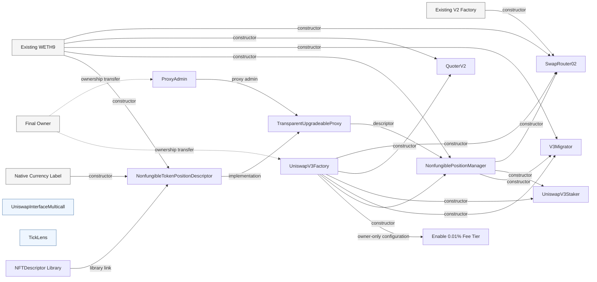
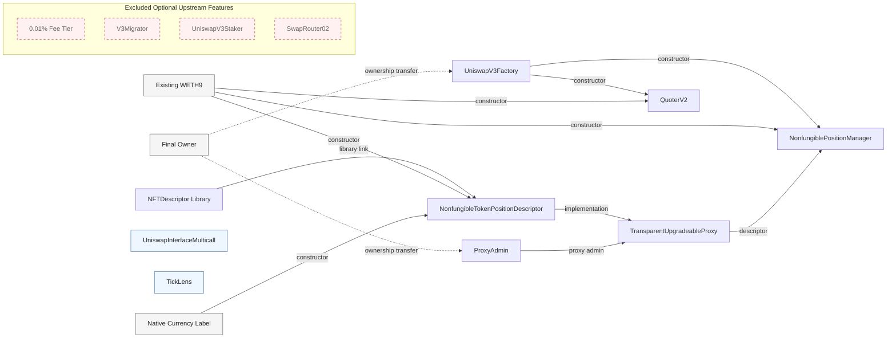

# Corner Store Deployment Profile

## Purpose

`CORNER_STORE_MIGRATION_STEPS` is the minimal Uniswap v3 venue deployment
profile currently selected for Corner Store. It keeps the contracts needed to
create pools, manage LP positions, inspect venue state, quote swaps, and
transfer administrative ownership.

This profile is a deployment building block. It does not yet deploy the Corner
Store compliance layer or provide a complete product deployment command.

## Included Steps

The steps must remain in dependency order:

1. Deploy `UniswapV3Factory`.
2. Deploy `UniswapInterfaceMulticall`.
3. Deploy `ProxyAdmin`.
4. Deploy `TickLens`.
5. Deploy the `NFTDescriptor` library.
6. Deploy `NonfungibleTokenPositionDescriptor`.
7. Deploy its `TransparentUpgradeableProxy`.
8. Deploy `NonfungiblePositionManager`.
9. Deploy `QuoterV2`.
10. Transfer `UniswapV3Factory` ownership.
11. Transfer `ProxyAdmin` ownership.

Addresses produced by earlier steps are stored in the migration state and used
as constructor arguments by later steps. Ownership transfers therefore remain
last unless a new owner-controlled configuration step is intentionally added.

## Dependency Diagrams

The arrows below point from a required input or controlling contract to the
contract or action that consumes it. Independent utilities such as
`UniswapInterfaceMulticall` and `TickLens` have no constructor dependency on the
other deployed contracts.

### Before: Upstream Full Deployment

### After: Corner Store Minimal Profile

The second diagram describes the current deployment profile, not the final
Corner Store product architecture. The compliance layer, product router, and
matching-engine adapters have not yet been added to this tool.

## Deliberately Excluded Steps

### `ADD_1BP_FEE_TIER`

This step enables the 0.01% fee tier with tick spacing 1.

- Reason for exclusion: allowed fee tiers are a venue and governance policy,
  not a dependency of the base deployment.
- Reintroduction condition: Corner Store has approved the fee-tier policy for
  the relevant asset or venue.
- Ordering constraint: it must run before factory ownership is transferred, or
  be executed later by the transferred owner.

### `DEPLOY_V3_MIGRATOR`

This contract migrates Uniswap v2 liquidity into v3 positions.

- Reason for exclusion: the current product scope does not require importing
  existing Uniswap v2 LP positions.
- Reintroduction condition: a supported v2-to-v3 migration flow, including
  token approval and compliance requirements, has been specified.
- Dependencies: V3 factory, WETH9, and `NonfungiblePositionManager`.

### `DEPLOY_V3_STAKER`

This contract supports incentive programs for staked v3 LP NFTs.

- Reason for exclusion: liquidity mining and reward distribution are outside
  the current venue deployment scope and may introduce additional eligibility
  and distribution controls.
- Reintroduction condition: the LP incentive model and its compliance
  requirements have been approved.
- Dependencies: V3 factory and `NonfungiblePositionManager`.

### `DEPLOY_V3_SWAP_ROUTER_02`

This is the upstream general-purpose router across Uniswap v2 and v3.

- Reason for exclusion: Corner Store expects execution to be coordinated by a
  product-owned routing and compliance layer rather than publishing an
  unguarded upstream convenience router as the supported entry point.
- Reintroduction condition: only if its role and bypass implications are
  explicitly accepted. The preferred direction is a Corner Store router or
  adapter with asset-policy-aware routing.
- Dependencies: V2 factory, V3 factory, `NonfungiblePositionManager`, and
  WETH9.

Omitting `SwapRouter02` does **not** make a standard Uniswap v3 pool compliant
or prevent direct pool calls. Enforcement must exist at a boundary that cannot
be bypassed, such as the regulated token transfer rules, venue/pool
allowlisting, or modified execution contracts. The product-owned
`ExecutionRouter` and `ComplianceEngine` form an orchestration and
supported-entry-point layer unless the underlying assets or venue also enforce
the same policy.

## Current Guarantees

The profile has been verified on Anvil to:

- execute all 11 steps successfully;
- deploy runtime bytecode for all nine expected contract addresses;
- wire the factory and WETH9 addresses into
  `NonfungiblePositionManager` and `QuoterV2`;
- transfer factory and proxy-admin ownership; and
- omit the migrator, staker, and `SwapRouter02`.

The automated unit test locks the profile contents and dependency order. The
Anvil run performed during profile extraction was a deployment integration
check; it is not yet a committed automated integration test.

## Not Yet Provided

- A CLI or public API that selects this profile. The existing CLI still runs
  `UPSTREAM_MIGRATION_STEPS`.
- Deployment of Corner Store compliance, asset registry, routing, order-book,
  or RFQ contracts.
- A unified deployment manifest across Uniswap and Corner Store contracts.
- Pool creation, liquidity provisioning, swaps, or end-to-end compliance
  tests.
- Production network configuration, contract verification, multisig handoff,
  or upgrade-governance procedures.

## Integration Direction

The future product deployment orchestrator should call this profile as one
module and then deploy and configure Corner Store-owned components:

1. Deploy the Uniswap v3 venue profile.
2. Deploy the compliance registry and enforcement components.
3. Deploy the product router and matching-engine adapters.
4. Register approved assets, venues, pools, and engine policies.
5. Transfer ownership and privileged roles to their final governance accounts.
6. Write one versioned deployment manifest containing every address and
   configuration decision.

Do not add optional upstream steps back to
`CORNER_STORE_MIGRATION_STEPS` merely because they exist upstream. Record the
product requirement, compliance boundary, owner, and test coverage that justify
each addition.
